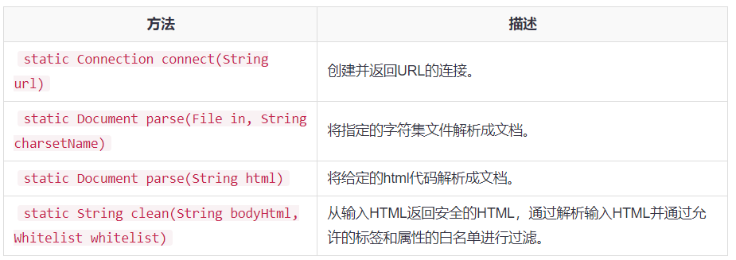

#### 主要的类

* org.jsoup.Jsoup类

  Jsoup类是任何Jsoup程序的入口点，并将提供各种来源加载和解析HTML文档的方法

  主要方法：

  

  ```java
  public static Document parseDocumentFromUrl(){
          Document doc = null;
          try {
              doc = Jsoup.connect("http://www.google.com/").get();
              //获取标题
              String title = doc.title();
              System.out.println(title);//输出：Google
              //data(key,value)是该URL要求的参数
              //userAgent制定用户使用的代理类型
              //cookie带上cookie，如cookie("JSESSIONID","FDE234242342342423432432")
              //连接超时时间
              //post或者get方法
              doc = Jsoup.connect("http://www.xxxxx.com/")
                        .data("query", "Java")
                        .userAgent("Mozilla")
                        .cookie("auth", "token")
                        .timeout(3000)
                        .post();
               
          } catch (IOException e) {
              e.printStackTrace();
          }
          return doc;
      }
      /**
       * 从文件加载
       * @return Document
       */
      public static Document parseDocumentFromFile(){
          File input = new File("/tmp/input.html");
          Document doc=null;
          try {
              //从文件加载Document文档
              doc = Jsoup.parse(input, "UTF-8");
              System.out.println(doc.title());
          } catch (IOException e) {
              e.printStackTrace();
          }
          return doc;
      }
  ```

* org.jsoup.nodes.Documet类

  该类表示通过Jsoup库加载HTML文档。可以用此类执行适用于整个文档的操作。

  代码同上

* org.jsoup.nodes.Element类

  HTML元素是由标签名称，属性和子节点组成。使用Element类，可以提取数据，遍历节点和操作HTML

  ```java
  public static void main(String[] args) {
  		Document doc;
  		try {
  			// 获取文档
  			doc = Jsoup.connect("http://xxx.com/").get();

  			/***** 获取单一元素 ******/
  			// 与JS类似的根据ID选择的选择器<div id="content"></div>
  			Element content = doc.getElementById("content");

  			/***** 一下方法的返回值都是Elements集合 ******/

  			// 获取所有的a标签<a href="#"></a>
  			content.getElementsByTag("a");
  			// 类选择器<div></div>
  			doc.getElementsByClass("divClass");
  			// 获取Document的所有元素
  			doc.getAllElements();
  			// 根据属性获取元素<a href="#"></a>
  			doc.getElementsByAttribute("href");
  			// 根据属性前缀获取元素 <li data-name="Peter Liu" data-city="ShangHai" data-lang="CSharp"
  			// data-food="apple">
  			doc.getElementsByAttributeStarting("data-");
  			// 根据key-value选择如<a href="http://xdemo.org"></a>
  			doc.getElementsByAttributeValue("href", "http://xdemo.org");
  			// 和上面的正好相反
  			doc.getElementsByAttributeValueNot("href", "http://xdemo.org");
  			// 根据key-value,其中value可能是key对应属性的一个子字符串，选择如<a href="http://xdemo.org"></a>
  			doc.getElementsByAttributeValueContaining("href", "xdemo");
  			// 根据key-value,其中key对应值的结尾是value，选择如<a href="http://xdemo.org"></a>
  			doc.getElementsByAttributeValueEnding("href", "org");
  			// 和上面的正好相反
  			doc.getElementsByAttributeValueStarting("href", "http://xdemo");
  			// 正则匹配，value需要满足正则表达式，<a href="http://xdemo.org"></a>,如href的值含有汉字
  			doc.getElementsByAttributeValueMatching("href", Pattern.compile("[\u4e00-\u9fa5]"));
  			// 同上
  			doc.getElementsByAttributeValueMatching("href", "[\u4e00-\u9fa5]");
  			// 根据元素所在的z-index获取元素
  			doc.getElementsByIndexEquals(0);
  			// 获取z-index大于x的元素
  			doc.getElementsByIndexGreaterThan(0);
  			// 和上面的正好相反
  			doc.getElementsByIndexLessThan(10);

  			// 遍历标签
  			for (Element link : content.getElementsByTag("a")) {
  				String linkHref = link.attr("href");
  				String linkText = link.text();
  			}

  			/************** 一些其他常用的方法 **************/
  			// 获取网页标题
  			doc.title();
  			// 获取页面的所有文本
  			doc.text();

  			// 为元素添加一个css class
  			content.addClass("newClass");
  			// 根据属性获取值
  			content.attr("id");
  			// 获取所有子元素
  			content.children();
  			// 获取元素内的所有文本
  			content.text();
  			// 获取同级元素
  			content.siblingElements();

  		} catch (Exception e) {
  			e.printStackTrace();
  		}

  	}
  ```

  ​