#### 基本shell命令：

 * pwd		显示shell会话的当前目录

   

 * ls              显示当前目录下的文件和目录

   * ls -F    在目录后面加了正斜线（/）

     

   * ls -F -R 列出当前目录及其子目录下的文件，R为递归选项

     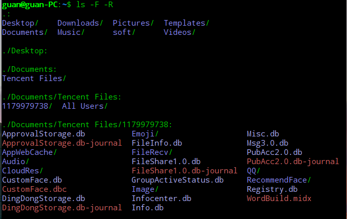

   * ls -l    显示目录和文件的更多信息

     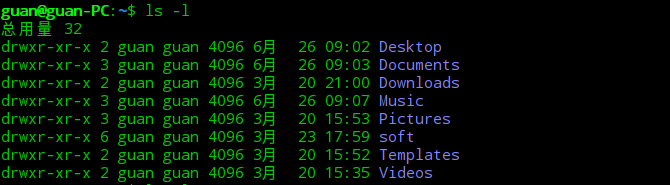

   * ls -l  ?test*   过滤输出列表

     问号（？）代表一个字符

     星号（*）代表零个或者多个字符

     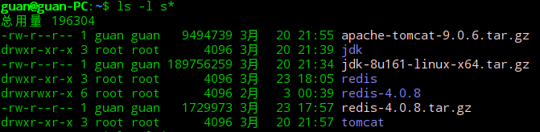

   * 文件类型：目录（d）、文件（-）、字符型文件（c）或者块设备（b）

* touch test  创建文件

  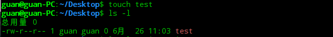

* ls -l --time=atime test 修改文件时间

  

* cp source destination 复制文件

  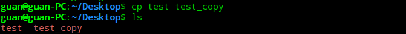

* cp -R source destination 递归的复制整个目录的内容 

* ln -s test sl_test 符号链接，是两个完全不同的文件

  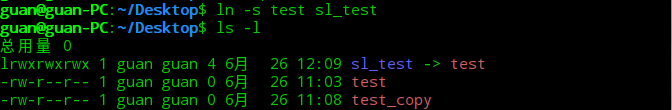

* ln test_copy hl_test_copy 硬链接 他们是同一个文件，内容相同

  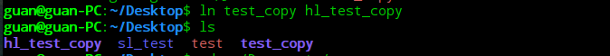

* mv test_copy ../Document   移动文件

  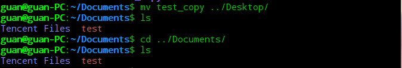

* mv test test_1    重命名

  

* rm -i  test 询问是否要移除文件

  

* rm -rf test 强制直接移除文件

  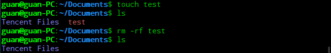

* mkdir new_dir   创建目录

  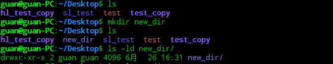

* rmdir new_dir  删除空目录

  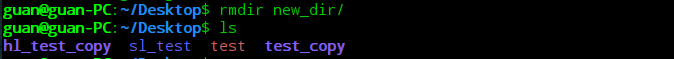

* rm -rf new_dir 删除目录，包括文件及其子文件

  

* file test    查看文件类型

* cat test    查看整个文件

  

* cat -n test    给所有行添加行号

  

* cat -b test    只给有文本的行添加行号

* cat -T test    不显示制表符

  * more    通过按空格或者回车键以逐行的方式向前浏览文本文件
  * less    是more的升级版，可以识别上下键及上下翻页键

* tail test    显示文件的最后几行，默认10行

* tail -n 5 test    显示文件的最后5行

* head test 显示文件的最开始几行，默认10行

* head -n 5 test 显示文件的开始5行

* ps -ef    查看系统上运行的所有进程，（-e）显示所有进程，（-f）显示完整格式输出

  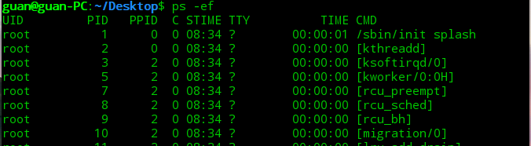

* ps -l    长格式输出

  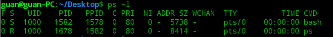

* ps l    可以输出更详细的进程状态码（STAT列）

  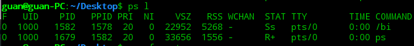

* ps --forest    显示进程的层级信息

  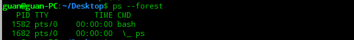

* top    实时监测进程

  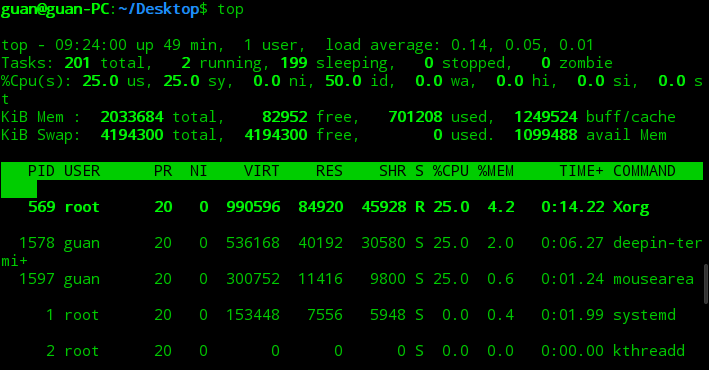

* kill 3940    让进程3940尽可能停止运行

* killall http*    可以通过进程名而不是PID来结束进程

* mount    输出当前系统上挂载的设备列表

* mount -t type device directory    手动挂载媒体设备的基本命令

* umount [directory | device]    卸载可移动设备

* df    查看已挂载磁盘的使用情况

  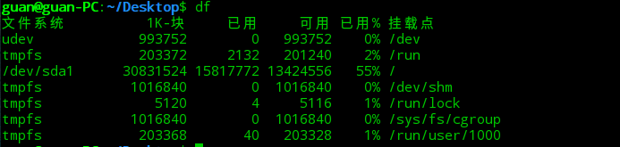

* df -h    把输出中的磁盘空间按照用户易读的形式显示

  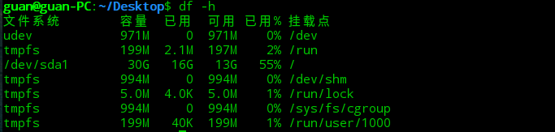

* du    显示某个特定目录的磁盘使用情况

  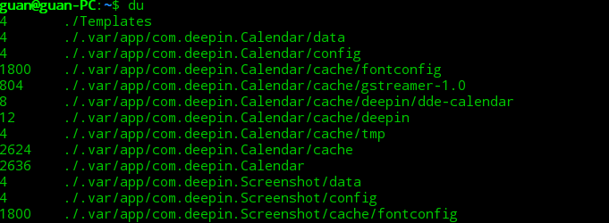

* du -c    显示所有已列出文件总的大小

  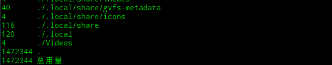

* du -h    按用户易读的格式输出

  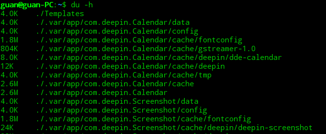

* du -h    显示每个输出参数的总计

* sort test    按照会话指定的默认语言的排序规则对文本文件中的数据进行排序

  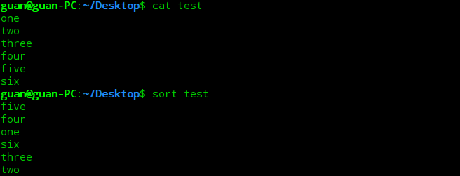

* sort -n test    把数字识别成数字而不是字符，并按值排序

  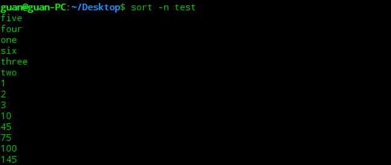

* sort -M test    按月份名排序

* grep    会在输入或者指定文件中查找包含匹配指定模式的字符的行

  * grep three test

    

  * grep t test    匹配包含t的字符串

    

  * grep -v t test    进行反向搜索（输出不匹配该模式的行）

    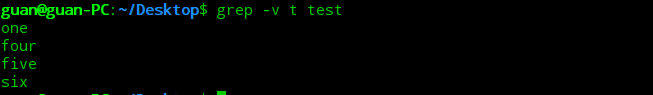

  * grep -n t test    显示匹配模式的行所在的行号

    

  * grep -c t test    显示有多少行含有匹配的模式

    

  * grep -e t -e f test    指定多个匹配模式，用参数（-e）

    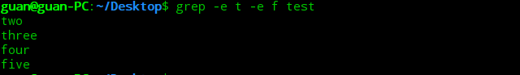

* tar -zcvf test_tar.tar.gz test_tar 压缩文件test到当前目录

  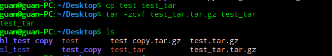

* tar -zxvf test_tar.tar.gz 解压文件test_tar.tar.gz到当前目录

  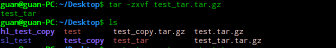

  * -z    将输出重定向给gzip命令
  * -c    创建一个新的tar归档文件（压缩）
  * -v    在处理文件时显示文件
  * -f    输出结果到文件或者设备file
  * -x    从已有归档文件中提取文件（解压）
  * -C    切换到指定目录

* ​

在使用linux时，经常需要进行文件查找。其中查找的命令主要有find和grep。

**区别**：

(1)find命令是根据**文件的属性**进行查找，如文件名，文件大小，所有者，所属组，是否为空，访问时间，修改时间等。 

 (2)grep是根据**文件的内容进行**查找，会对文件的每一行按照给定的模式(patter)进行匹配查找。