#### 基本shell命令：

 * pwd		显示shell会话的当前目录

   

 * ls              显示当前目录下的文件和目录

   * ls -F    在目录后面加了正斜线（/），区分文件和目录

     

   * ls -F -R    列出当前目录及其子目录下的文件，R为递归选项

     

   * ls -l    显示目录和文件的更多信息

     

   * ls -a    显示隐藏文件

     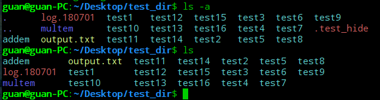

   * ls -l  ?test*   过滤输出列表

     问号（？）代表一个字符

     星号（*）代表零个或者多个字符

     

   * 文件类型：目录（d）、文件（-）、字符型文件（c）、块设备（b）、链接（l）、网络设备（n）

* touch test  创建文件

  

* ls -l --time=atime test 修改文件时间

  

* cp source destination 复制文件

  

* cp -R source destination 递归的复制整个目录的内容 

* ln -s test sl_test 符号链接，是两个完全不同的文件。符号链接就是一个实实在在的文件，它指向存放在虚拟目录结构中某个地方的另一个文件

  

* ln test_copy hl_test_copy 硬链接 他们是同一个文件，内容相同。硬链接会创建独立的虚拟文件，其中包含了原始文件的信息及位置

  

  $说明：只能对处于同一存储媒体的文件创建硬链接。要想在不同存储媒体的文件之间创建链接，只能使用符号链接。$

* mv test_copy ../Document   移动文件

  

* mv test test_1    重命名

  

* rm -i  test 询问是否要移除文件

  

* rm -rf test 强制直接移除文件

  

* mkdir new_dir   创建目录

  

* rmdir new_dir  删除空目录

  

* rm -rf new_dir 删除目录，包括文件及其子文件

  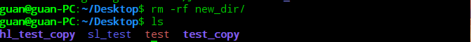

* file test    查看文件类型

* cat test    查看整个文件

  

* cat -n test    给所有行添加行号

  

* cat -b test    只给有文本的行添加行号

* cat -T test    不显示制表符

  * more    通过按空格或者回车键以逐行的方式向前浏览文本文件
  * less    是more的升级版，可以识别上下键及上下翻页键

* tail test    显示文件的最后几行，默认10行

* tail -n 5 test    显示文件的最后5行

* head test 显示文件的最开始几行，默认10行

* head -n 5 test 显示文件的开始5行

* ps -ef    查看系统上运行的所有进程，（-e）显示所有进程，（-f）显示完整格式输出

  

  * UID：启动这些进程的用户
  * PID：进程的进程ID
  * PPID：父进程的进程号（如果该进程是由另一个进程启动的）
  * C：进程生命周期中的CPU利用率
  * STIME：进程启动时的系统时间
  * TTY：进程启动时的终端设备
  * TIME：运行进程需要的累计CPU时间
  * CMD：启动的程序名称

* ps -l    长格式输出

  

* ps l    可以输出更详细的进程状态码（STAT列）

  

  * F：内核分配给进程的系统标记
  * S：进程的状态（O代表正在运行；S代表在休眠；R代表可运行，正等待运行；Z代表僵化，进程已结束但父进程已不存在；T代表停止）
  * PRI：进程的优先级（越大的数字代表越低的优先级）
  * NI：谦让度值用来参与决定优先级
  * ADDR：进程的内存地址
  * SZ：假如进程被换出，所需交换空间的大致大小
  * WCHAN：进程休眠的内核函数的地址

* ps --forest    显示进程的层级信息

  

* top    实时监测进程

  

* kill 3940    让进程3940尽可能停止运行

* killall http*    可以通过进程名而不是PID来结束进程

* mount    输出当前系统上挂载的设备列表

* mount -t type device directory    手动挂载媒体设备的基本命令

* umount [directory | device]    卸载可移动设备

* df    查看已挂载磁盘的使用情况

  

* df -h    把输出中的磁盘空间按照用户易读的形式显示

  

* du    显示某个特定目录的磁盘使用情况

  

* du -c    显示所有已列出文件总的大小

  

* du -h    按用户易读的格式输出

  

* du -h    显示每个输出参数的总计

* sort test    按照会话指定的默认语言的排序规则对文本文件中的数据进行排序

  

* sort -n test    把数字识别成数字而不是字符，并按值排序

  

* sort -M test    按月份名排序

* grep    会在输入或者指定文件中查找包含匹配指定模式的字符的行

  * grep three test

    

  * grep t test    匹配包含t的字符串

    

  * grep -v t test    进行反向搜索（输出不匹配该模式的行）

    

  * grep -n t test    显示匹配模式的行所在的行号

    

  * grep -c t test    显示有多少行含有匹配的模式

    

  * grep -e t -e f test    指定多个匹配模式，用参数（-e）

    

* tar -zcvf test_tar.tar.gz test_tar 压缩文件test到当前目录

  

* tar -zxvf test_tar.tar.gz 解压文件test_tar.tar.gz到当前目录

  

  * -z    将输出重定向给gzip命令
  * -c    创建一个新的tar归档文件（压缩）
  * -v    在处理文件时显示文件
  * -f    输出结果到文件或者设备file
  * -x    从已有归档文件中提取文件（解压）
  * -C    切换到指定目录

* ps -f    显示shell的父子关系

  

* ps --forest    显示子shell间的嵌套关系

  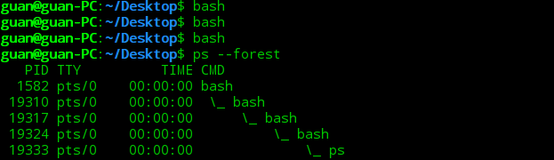

* pwd ; ls ; cd /ect ; pwd ; cd ; pwd ; ls    命令列表

* (pwd ; ls ; cd /ect ; pwd ; cd ; pwd ; ls)    命令包含在括号内，即为进程列表

* sleep 11&    进程在后台睡眠11秒

* jobs -l    显示当前在后台模式中运行的所有用户的进程（作业）

  

* echo $BASH_SUBSHELL    查看是否创建了子进程

  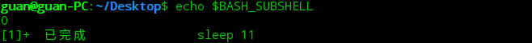

* coproc sleep 10    协程

  

* coproc My_Job { sleep 10; }    给协程起名字为My_Job，{}内部左右必须有空格

  

* which ps    which可以查看外部命令

  

* type -a echo    显示内建命令和外部命令

  

* history    查看所有用过的命令

  

* !!   使用最近使用的历史命令

  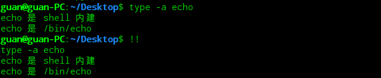

* ! 10    使用历史记录中第10条命令

* alias -p    命令别名

  

* alias li='ls -li'    设置别名

* ##### 环境变量（environment variable）:存储有关shell会话和工作环境的信息。

* 全局变量：

  * printenv / env    显示全局变量

    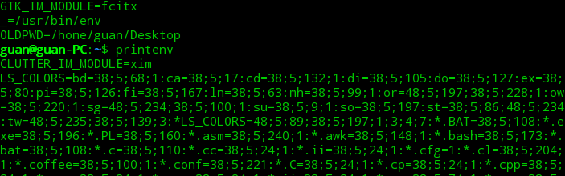

  * printenv HOME    显示特定的环境变量值

  * echo $HOME    在变量前加美元符，不仅要显示变量当前值，也可以让变量作为命令行参数

  * ls $HOME

    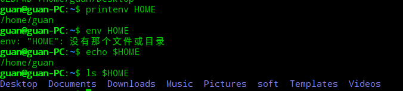

* 局部变量：

  * 设置用户自定义的变量

    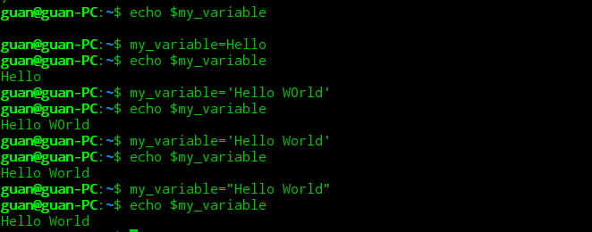

    **变量名、等号和值之间没有空格**

* 设置全局环境变量

  * 通过export命令完成，变量名前面不加$

  * 修改子shell中全局变量不会影响到父shell中该变量的值

  * 子shell无法使用export来改变父shell中全局环境变量的值

    

* 删除环境变量：如果是在子进程中删除了全局变量，这只是对子进程有效，该全局变量在父进程中依然有效。

  

* **规则：如果要用到变量，使用$，如果操作变量，不适用美元符。但是在使用printenv显示某个变量的值时候要在变量前面加上美元符。**

* 启动bashshell的三种方式：

  * 登录时作为默认登录shell
  * 作为非登录shell的交互式shell
  * 作为运行脚本的非交互式


* 安装软件程序（基于Debain的系统）

  dpkg命令是基于Debain系PMS工具的核心

  * apt -get

  * apt -cache

  * aptitude    完整的软件包管理系统

  * aptitude    进入aptitude的全屏模式

    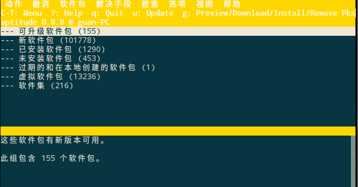

  * aptitude show mysql-client    显示某个特定包的详细信息

    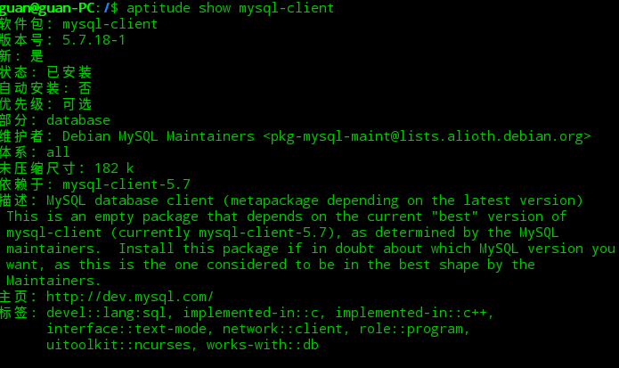

  * dpkg -L vim-common    跟某个特定软件包相关的所有文件的列表

    

  * aptitude search wine    查看系统是否已经安装了此包（i表示已经安装上了，p或v说明这个包可用，但还没有安装）

    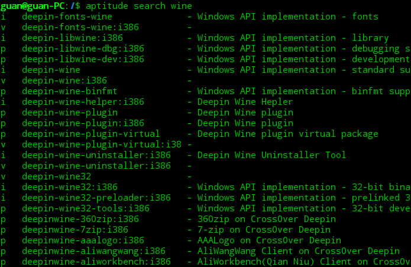

  * sudo aptitude install wine

    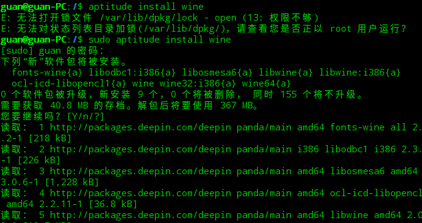

  * aptitude safe-upgrade    更新软件

  * sudo aptitude purge wine    卸载软件

    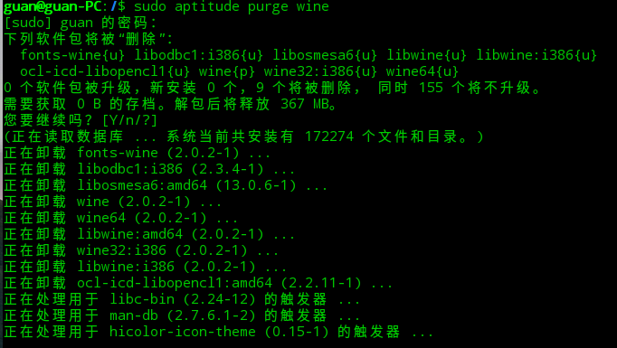

* 安装软件程序（基于Red Hat的系统）

  都是基于rpm命令行工具

  * yum
  * urpm
  * zypper
  * yum list installed    列出系统上已经安装的包
  * yum list xterm    查看某个特定安装包的详细信息
  * yum list install xterm 安装包
  * yum provides file_name    找到系统上某个文件属于哪个软件包
  * yum install package_name    安装软件
  * yum localinstall package_name.rpm    本地安装
  * yum list updates    列出需要更新的软件
  * yum update package_name    更新软件
  * yum update    更新所有软件
  * yum remove packa_name    只删除软件包而保留配置文件和数据文件
  * yum erase package_name    删除软件和它所有的文件

* 日志文件系统

  * 数据模式：索引节点和文件都会被写入日志；丢失数据风险低，但性能差
  * 有序模式：只有索引节点数据会被写入日志，但只有数据成功写入后才删除；在性能和安全性之间取得了良好的折中
  * 回写模式：只有索引节点数据会被写入日志，但不控制文件数据何时写入；丢失数据风险高，但仍比不用日志好

* fdisk    创建分区

* fsck    文件系统的检查与修复

* vim编辑器

  两种操作模式：

  * 普通模式
  * 插入模式

* 普通模式下：

  h：左移一个字符

  J：下移一行

  k：上移一行

  L：右移一个字符

  PageDown（或Ctrl+F）：下翻一屏

  PageUp（或Ctrl+B）：上翻一屏

  G：移到缓冲区的最后一行

  num G：移动到缓冲区中的第num行

  gg：移到缓冲区的第一行

  x：删除当前光标所在位置

  dd：删除当前光标所在行

  p：粘贴文本

  y：复制文本，y代表（yank）。yw代表复制一个单词，y$代表复制到行尾

  ###### 查找和替换：

    :s/old/new/g ：一行命令替换所有 old 。
    :n,ms/old/new/g ：替换行号 n 和 m 之间所有 old 。
    :%s/old/new/g ：替换整个文件中的所有 old 。
    :%s/old/new/gc ：替换整个文件中的所有 old ，但在每次出现时提示。

* shell脚本编程

  ```shell
  #! /bin/bash
  #脚本第一行需要写上此格式
  ```

  echo    用于交互

  将命令输出赋给变量：

  * ```shell
    #反引号字符（`）
    testing=`date`
    ```

  * ```shell
    #$()格式
    testing=$(date)
    ```

  重定向输入输出：

  * command > outputfile    将命令发送到一个文件中

  * command >> outputfile    将命令的输出追加到已有文件中

  * command < inputfile    将文件的内容重定向到命令

  * command << inputfile    无需使用文件进行重定向，只需要在命令行中指定用于输入重定向的数据就可以了。除了<<符号，须指定一个文本标记来划分输入数据的开始和结尾。任何字符串都可作为文本标记，但在数据的开始和结尾文本标记必须一致。

    **记忆：在命令行上，命令总是在左侧，而重定向符号“指向”数据流动的方向**

  管道：command1 | command2    将一个命令的输出作为另一个命令的输入

  expr    执行数学运算

  * 数学运算    对于那些容易被shell错误解释的字符：

    1、用转义字符（\）标出。例：expr 5 \ * 2。

    2、使用美元符和方括号（$[poperation]）将数学表达式围起来

    内建的bash计算器可以解决浮点计算问题，例：

    ```bash
    $ bc -q
    var1=10
    var1*4
    40
    var2=var1 / 5
    print var2
    2
    quit
    $
    ```

    将所有bash计算器涉及的部分都放到同一个脚本文件的不同行：

    ```shell
    #!/bin/bash
    var1=10.46
    var2=43.67
    var3=33.2
    var4=71
    var5=$(bc << EOF
    scale = 4
    a1 = ( $var1 * $var2)
    b1 = ($var3 * $var4)
    a1 + b1
    EOF
    )
    echo The final answer for this mess is $var5
    ```

    退出脚本：

    * 查看退出状态码

      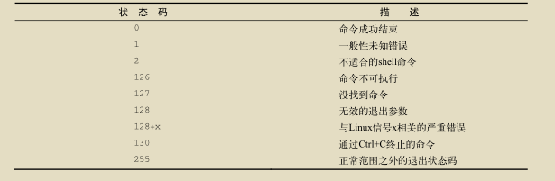

    * exit命令：允许在脚本结束的时候指定一个状态码

  * 逻辑运算

  * 比较运算

  * 字符串运算

  结构化命令：

  * if-then语句

    ```shell
    if command
    then
    	commands
    fi
    ```

  * if-then-else语句

    ```shell
    if command
    then
       commands
    else
       commands
    fi
    ```

  * 嵌套if

  * 使用else的另一种形式：elif

    ```shell
    if command1
    then
    	commands
    elif command2
    then
    	more commands
    fi
    ```

  * test命令：

    test condition

    如果 test 命令中列出的条件成立，test 命令就会退出并返回退出状态码 0；如果条件不成立， test 命令就会退出并返回非零的退出状态码，这使得
    if-then 语句不会再被执行。

    bash shell提供了另一种测试方法：

    ```shell
    if [condition]
    then
    	commands
    fi
    ```

    test命令可以判断三类条件：

    1、数值比较：

    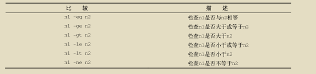

    2、字符串比较：

    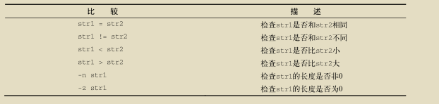

    ​	字符串顺序：

    ​	大于号和小于号必须转义，否则shell会把它们当作重定向符号，把字符串值当作文件名

    ​	大于和小于顺序和sort命令所采用的不同

    3、文件比较：

    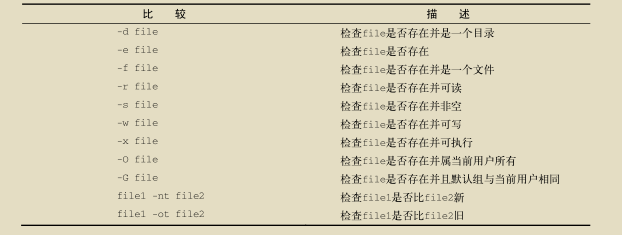

    复合条件测试：

      [ condition1 ] && [ condition2 ]    AND布尔运算符
      [ condition1 ] || [ condition2 ]    OR布尔运算符

    if-then的高级特性：

    1、用于数学表达式的双括号(( expression ))

    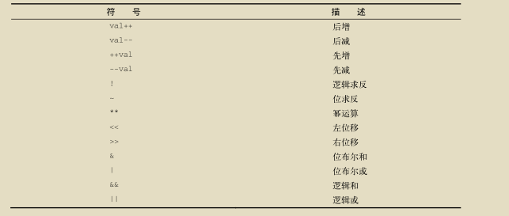

    2、用于高级字符串处理功能的双方括号[[ expression ]]

    ​	另一个特性——模式匹配，可以定义正则表达式

    case命令：将指定的变量与不同模式进行比较

    ```shell
    case variable in
    pattern1 | pattern2) command1;;
    pattern3) commands2;;
    *) default commands;;
    esac
    ```

    for命令：

    从列表中读取值：

    ```shell
    for var in list
    do
    	commands
    done
    ```

    从命令中读取值：

    ```shell
    #!/bin/bash
    # reading values from a file
    file="states"
    for state in $(cat $file)
    do
    	echo "Visit beautiful $state"
    done

    ```

    字段分隔符：默认情况下bash shell会将空格、制表符、换行符

    通常用法：

    IFS.OLD=$IFS

    IFS=$'\n':;"

     <在代码中使用新的IFS值>

    IFS=$IFS.OLD

    用通配符读取命令：

    ```shell
    #!/bin/bash
    # iterate through all the files in a directory
    for file in /home/guan/Desktop/test_dir/*
    do
     	if [ -d "$file" ]
     	then
     		echo "$file is a directory"
     	elif [ -f "$file" ]
     	then
     		echo "$file is a file"
     fi
    done
    ```

    C语言风格的for命令：

    ```shell
    #! /bin/bash
    #testing the C-style for loop

    for (( a=1,b=10; a <= 10; a++, b-- ))
    do
    	echo "$a - $b"
    done
    ```

    whlie命令：

    ```shell
    #! /bin/bash
    # while command test

    ```

    ​

在使用linux时，经常需要进行文件查找。其中查找的命令主要有find和grep。

**区别**：

(1)find命令是根据**文件的属性**进行查找，如文件名，文件大小，所有者，所属组，是否为空，访问时间，修改时间等。 

 (2)grep是根据**文件的内容进行**查找，会对文件的每一行按照给定的模式(patter)进行匹配查找。