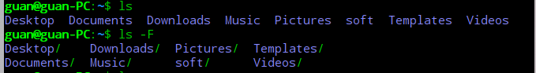

#### 基本shell命令：

 * pwd		显示shell会话的当前目录

   

 * ls              显示当前目录下的文件和目录

   * ls -F    在目录后面加了正斜线（/）

     

   * ls -F -R 列出当前目录及其子目录下的文件，R为递归选项

     

   * ls -l    显示目录和文件的更多信息

     

   * ls -l  ?test*   过滤输出列表

     问号（？）代表一个字符

     星号（*）代表零个或者多个字符

     

   * 文件类型：目录（d）、文件（-）、字符型文件（c）或者块设备（b）

* touch test  创建文件

  

* ls -l --time=atime test 修改文件时间

  

* cp source destination 复制文件

  

* cp -R source destination 递归的复制整个目录的内容 

* ln -s test sl_test 符号链接，是两个完全不同的文件

  

* ln test_copy hl_test_copy 硬链接 他们是同一个文件，内容相同

  

* mv test_copy ../Document   移动文件

  

* mv test test_1    重命名

  

在使用linux时，经常需要进行文件查找。其中查找的命令主要有find和grep。

**区别**：

(1)find命令是根据**文件的属性**进行查找，如文件名，文件大小，所有者，所属组，是否为空，访问时间，修改时间等。 

 (2)grep是根据**文件的内容进行**查找，会对文件的每一行按照给定的模式(patter)进行匹配查找。