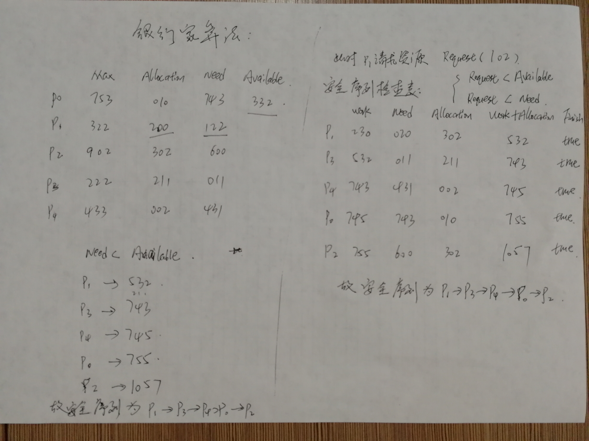

#### 银行家算法（避免死锁）：

死锁：

​	如果一组进程中的每一个进程都在等待仅由该组进程中的其他进程才能引发的事件，那仫该组进程就是死锁的。

产生死锁的必要条件：

* 互斥条件：一个资源每次只能被一个线程使用。
* 请求与保持条件：一个线程因请求资源而阻塞时，对已获得的资源保持不放。
* 不剥夺条件：线程已获得的资源，在未使用完之前，不能强行剥夺。
* 循环等待条件：若干线程之间形成一种头尾相接的循环等待资源关系。

产生死锁的原因：

* 竞争可重用不可抢占式的资源

  可重用性资源:可供重复使用多次的资源。

  不可抢占性资源:一旦系统把某资源分配给该进程后，就不能将它强行收回，只能在进程使用完后自动释放。

* 竞争可消耗资源

  可消耗资源:又叫临时性资源，它是在进程运行期间，由进程动态的创建和消耗的。

* 程推进顺序不当

利用银行家算法来避免死锁：

* 数据结构：

  1. 可利用资源向量Available
  2. 最大需求矩阵Max
  3. 分配矩阵Allocation
  4. 需求矩阵Need

* 算法原理：

  我们可以把操作系统看作是银行家，操作系统管理的资源相当于银行家管理的资金，进程向操作系统请求分配资源相当于用户向银行家贷款。
  为保证资金的安全，银行家规定：

  1. 当一个顾客对资金的最大需求量不超过银行家现有的资金时就可接纳该顾客；
  2. 顾客可以分期贷款，但贷款的总数不能超过最大需求量；
  3. 当银行家现有的资金不能满足顾客尚需的贷款数额时，对顾客的贷款可推迟支付，但总能使顾客在有限的时间里得到贷款；
  4. 当顾客得到所需的全部资金后，一定能在有限的时间里归还所有的资金。

  操作系统按照银行家制定的规则为进程分配资源，当进程首次申请资源时，要测试该进程对资源的最大需求量，如果系统现存的资源可以满足它的最大需求量则按当前的申请量分配资源，否则就推迟分配。当进程在执行中继续申请资源时，先测试该进程本次申请的资源数是否超过了该资源所剩余的总量。若超过则拒绝分配资源，若能满足则按当前的申请量分配资源，否则也要推迟分配。

* 算法步骤：

  Request请求向量：

  1. 如果Request[i] <= Need[i][j]转下步，否则它所需要的资源数已超过它所需要的最大值；

  2. 如果Request[i] <= Available[i][j]转下步，否则尚无足够资源，进程需等待；

  3. 系统试分配给进程p,并修改Available,Allocation和Need；

     ```java
     Available[j] -= Request[j];
     Allocation[i][j] += Request[j];
      Need[i][j] -= Request[j];
     ```

  4. 系统执行安全性算法，检查此次资源分配后系统是否处于安全状态。若安全，才正式分配；否则恢复原来的分配状态，让该进程等待。

* 安全性算法：

  1. 设置两个向量,工作向量Work,在执行安全性算法开始时 Work=Available;Finish:表示有足够的资源分配给进程，使之运行完成,Finish[i]=false;当有足够资源分配给进程时，再另Finish[i]=false；

  2. 从进程集合中找到一个满足该条件的进程：

     ```java
     Finish[i]=false;
     Need[i][j] <= Work[j];
     ```

  3. 当进程获得资源后，可顺利执行，并修改Work向量和Finsh向量：

     ```java
     Work[i] += Allocation[i][j];
     Finish[i]=true;
     ```

  4. 如果所有进程的Finish[i]=true说明系统处于安全状态，否则系统处于不安全状态。

  [银行家算法例题解析](https://www.cnblogs.com/xuxu8511/archive/2012/04/06/2435053.html)

  

