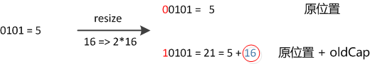

### 面试问题：

* java跨平台的原理：

  java虚拟机是一个可以执行Java字节码的虚拟机进程。Java源文件被编译成能被Java虚拟机执行的字节码文件。

  java通过不同的系统、不同版本、不同位数的java虚拟机，来屏蔽不同指令集差异而对外提供统一的接口。

* java中int占几个字节？

  4个，32位

* 面向对象的特征有哪些方面？

  封装：将对象封装成一个高度自治和相对封闭的个体

  抽象：找出一些事物的相似之处和共性之处

  继承：可以在一个已经存在的类的基础之上来进行，例如遗产的继承

  多态：父类或接口定义的引用变量指向子类或具体实现的类，程序在调用时才动态绑定。

* 有了基本的数据类型，为什么还需要包装类型？

  装箱：在编译时会调用valueOf()方法来装箱

  拆箱：把包装类型转换为基本数据类型，调用xxxValue();

  java是一种面向对象的语言，而基本的数据类型，不具备面向对象的特性，比如null值。

* "=="和equals方法的区别：

  ==用来判断两个变量之间的值是否相等。基本数据类型直接比较值（包装类型会触发自动拆箱的过程），引用数据类型要比较对应的引用的内存首地址（对于包装类型，equals方法并不会进行类型转换）；

  equals用来比较两个对象的某些特征是否一样。举例：两个Person对象的名字(name)是否一样，若一样，则相等。

  ```java
  public static void main(String[] args) {

  		Integer a = 1;
  		Integer b = 2;
  		Integer c = 3;
  		Integer d = 3;
  		Integer e = 321;
  		Integer f = 321;
  		Long g = 3L;
  		Long h = 2L;

  		System.out.println(c == d);
  		System.out.println(e == f);
  		System.out.println(c == (a + b));
  		System.out.println(c.equals(a + b));
  		System.out.println(g == (a + b));
  		System.out.println(g.equals(a + b));
  		System.out.println(g.equals(a + h));
  	}
  ```

  ```java
  //输出结果
  true
  false
  true
  true
  true
  false
  true
  ```

* String和StringBuilder的区别，StringBuffer和StringBuilder的区别

  String是内容不可变的字符串，底层使用了一个不可变的字符数组（private final char []）

  而StringBuilder和StringBuffer采用可变字符数组（char [] value）

  拼接字符串：

  String进行拼接，String c= "a" + "b";

  StringBuilder或者StringBuffer，StringBuilder sb = new StringBuilder();

  sb.append("a");

  StringBuilder是线程不安全的，效率较高。而StringBuffer是线程安全的，效率较低。（内部采用synchronized来修饰append方法）

* java中的集合

  Collection和Map

  List是有序的，可以重复；

  Set是无序的，不可以重复；根据equals和hashcode判断。

* ArrayList和LinkedList的区别：

  ArrayList使用数组，LinkedList使用的是链表。

  数组查询比较快（有索引），插入和修改比较慢，数组在内存中是一块连续的内存，如果插入或删除，需要移动内存。

  链表查询比较慢（需要从头部开始），插入和修改比较快（只需改变引用指向即可），链表不要求内存连续。

  ArrayList使用在查询比较多，而插入和删除比较少。而LinkedList相反。

* HashMap和HashTable的区别：

  HashMap和HashTable都使用哈希表来存储键值对。在数据结构上是基本相同的，都创建了一个继承自Map.Entry的私有的内部类Entry，每一个Entry对象表示存储在哈希表中的一个键值对。

  Entry对象唯一表示一个键值对，有四个属性：

  -K key 键对象
  -V value 值对象
  -int hash 键对象的hash值
  -Entry entry 指向链表中下一个Entry对象，可为null，表示当前Entry对象在链表尾部

  初始容量大小和每次扩充容量大小的不同：

  ```java
  以下代码及注释来自java.util.HashTable
   
  // 哈希表默认初始大小为11
  public Hashtable() {
      this(11, 0.75f);
  }
   
  protected void rehash() {
      int oldCapacity = table.length;
      Entry<K,V>[] oldMap = table;
   
      // 每次扩容为原来的2n+1
      int newCapacity = (oldCapacity << 1) + 1;
      // ...
  }
   
   
  以下代码及注释来自java.util.HashMap
   
  // 哈希表默认初始大小为2^4=16
  static final int DEFAULT_INITIAL_CAPACITY = 1 << 4; // aka 16
   
  void addEntry(int hash, K key, V value, int bucketIndex) {
      // 每次扩充为原来的2n 
      if ((size >= threshold) && (null != table[bucketIndex])) {
         resize(2 * table.length);
  }
  ```

  HashTable默认的初始大小为11，之后每次扩充为原来的2n+1。HashMap默认的初始化大小为16，之后每次扩充为原来的2倍。

  如果在创建时给定了初始化大小，那么HashTable会直接使用你给定的大小，而HashMap会将其扩充为2的幂次方大小。

  ​

  HashMap可以把null作为key或者value，而HashTable是不可以的；

  ```java
  以下代码及注释来自java.util.HashTable
   
  public synchronized V put(K key, V value) {
   
      // 如果value为null，抛出NullPointerException
      if (value == null) {
          throw new NullPointerException();
      }
   
      // 如果key为null，在调用key.hashCode()时抛出NullPointerException
   
      // ...
  }
   
   
  以下代码及注释来自java.util.HasMap
   
  public V put(K key, V value) {
      if (table == EMPTY_TABLE) {
          inflateTable(threshold);
      }
      // 当key为null时，调用putForNullKey特殊处理
      if (key == null)
          return putForNullKey(value);
      // ...
  }
   
  private V putForNullKey(V value) {
      // key为null时，放到table[0]也就是第0个bucket中
      for (Entry<K,V> e = table[0]; e != null; e = e.next) {
          if (e.key == null) {
              V oldValue = e.value;
              e.value = value;
              e.recordAccess(this);
              return oldValue;
          }
      }
      modCount++;
      addEntry(0, null, value, 0);
      return null;
  }
  ```

  HashMap是线程不安全的，效率较高，HashTable是线程安全的，效率较低；

  ```java
  以下代码及注释来自java.util.HashTable
   
  public synchronized V get(Object key) {
      Entry tab[] = table;
      int hash = hash(key);
      int index = (hash & 0x7FFFFFFF) % tab.length;
      for (Entry<K,V> e = tab[index] ; e != null ; e = e.next) {
          if ((e.hash == hash) && e.key.equals(key)) {
              return e.value;
          }
      }
      return null;
  }
   
  public Set<K> keySet() {
      if (keySet == null)
          keySet = Collections.synchronizedSet(new KeySet(), this);
      return keySet;
  }
  ```

* ​实现拷贝文件使用字节流还是字符流？

  若不确定文件的类型（如可能有图片、音频等），使用字节流，若确定文件的类型是文本，使用字符流。

* HashMap的实现原理：

  哈希表：哈希表是一种根据关键码去寻找值的数据映射结构。就像字典那样。

  哈希冲突：对于任意给定的对象，只要它的hashCode()返回值相同，那么用Hash算法得到的hash值一定相同。

  Hash算法：就是把任意长度的输入（又叫做预映射， pre-image），通过散列算法，变换成固定长度的输出，该输出就是散列值。

  解决冲突的办法：

  链地址法：如果遇到冲突，就在原地址上新建一个空间，然后以链表结点的形式插入到该空间。

  

  当程序试图存放一个key-value的时候，程序首先会根据key得到它的hashCode，然后通过hash算法获得对应的hash值，然后再获取指定hash值在对应的table中的索引。

  如果两个Entry的hashCode相等，那么程序会通过equals方法比较key的值：返回true，则新添加的Entry的value将覆盖集合中原有的value，但是key不会覆盖；返回false，则新添加的Entry将与原有Entry形成Entry链，而且新添加的Entry位于Entry链的头部。

  hashMap类的put操作的源代码：

  ```java
  public V put(K key, V value) 
  { 
      // 如果 key 为 null，调用 putForNullKey 方法进行处理
      if (key == null) 
          return putForNullKey(value); 
      // 根据 key 的 keyCode 计算 Hash 值
      int hash = hash(key.hashCode()); 
      // 搜索指定 hash 值在对应 table 中的索引
      int i = indexFor(hash, table.length);
      // 如果 i 索引处的 Entry 不为 null，通过循环不断遍历 e 元素的下一个元素
      for (Entry<K,V> e = table[i]; e != null; e = e.next) 
      { 
          Object k; 
          // 找到指定 key 与需要放入的 key 相等（hash 值相同
          // 通过 equals 比较放回 true）
          if (e.hash == hash && ((k = e.key) == key 
              || key.equals(k))) 
          { 
              V oldValue = e.value; 
              e.value = value; 
              e.recordAccess(this); 
              return oldValue; 
          } 
      } 
      // 如果 i 索引处的 Entry 为 null，表明此处还没有 Entry 
      modCount++; 
      // 将 key、value 添加到 i 索引处
      addEntry(hash, key, value, i); 
      return null; 
  }
  ```

  其中的hash算法：

  ```java
  static final int hash(Object key) {
      int h;
      return (key == null) ? 0 : (h = key.hashCode()) ^ (h >>> 16);
  }
  ```

  其中计算table中的索引值：

  ```java
  static int indexFor(int h, int length) 
  { 
      //h 是得到的hash值
      //length表示bucket的个数
      return h & (length-1); 
  }
  ```

  用于添加key-value对的方法：

  ```java
  void addEntry(int hash, K key, V value, int bucketIndex) 
  { 
      // 获取指定 bucketIndex 索引处的 Entry 
      Entry<K,V> e = table[bucketIndex];     // ①
      // 将新创建的 Entry 放入 bucketIndex 索引处，并让新的 Entry 指向原来的 Entry 
      table[bucketIndex] = new Entry<K,V>(hash, key, value, e); 
      // 如果 Map 中的 key-value 对的数量超过了极限
      if (size++ >= threshold) 
          // 把 table 对象的长度扩充到 2 倍。
          resize(2 * table.length);    // ②
  }
  ```

  一个非常优雅的设计：系统总是将新添加的 Entry 对象放入 table 数组的 bucketIndex 索引处——如果 bucketIndex 索引处已经有了一个 Entry 对象，那新添加的 Entry 对象指向原有的 Entry 对象（产生一个 Entry 链），如果 bucketIndex 索引处没有 Entry 对象，也就是上面程序①号代码的 e 变量是 null，也就是新放入的 Entry 对象指向 null，也就是没有产生 Entry 链。

  HashMap的构造函数：

  ```java
  // 以指定初始化容量、负载因子创建 HashMap 
  public HashMap(int initialCapacity, float loadFactor) 
  { 
      // 初始容量不能为负数
      if (initialCapacity < 0) 
          throw new IllegalArgumentException( 
         "Illegal initial capacity: " + 
              initialCapacity); 
      // 如果初始容量大于最大容量，让出示容量
      if (initialCapacity > MAXIMUM_CAPACITY) 
          initialCapacity = MAXIMUM_CAPACITY; 
      // 负载因子必须大于 0 的数值
      if (loadFactor <= 0 || Float.isNaN(loadFactor)) 
          throw new IllegalArgumentException( 
          loadFactor); 
      // 计算出大于 initialCapacity 的最小的 2 的 n 次方值。
      int capacity = 1; 
      while (capacity < initialCapacity) 
          capacity <<= 1; 
      this.loadFactor = loadFactor; 
      // 设置容量极限等于容量 * 负载因子
      threshold = (int)(capacity * loadFactor); 
      // 初始化 table 数组
      table = new Entry[capacity];            // ①
      init(); 
  }
  ```

  上面代码中代码包含了一个简洁的代码实现：找出大于 initialCapacity 的、最小的 2 的 n 次方值，并将其作为 HashMap 的实际容量（由 capacity 变量保存）。例如给定 initialCapacity 为 10，那么该 HashMap 的实际容量就是 16。

  HashMap的读取实现get(Object key)：

  ```java
  public V get(Object key) 
  { 
      // 如果 key 是 null，调用 getForNullKey 取出对应的 value 
      if (key == null) 
          return getForNullKey(); 
      // 根据该 key 的 hashCode 值计算它的 hash 码
      int hash = hash(key.hashCode()); 
      // 直接取出 table 数组中指定索引处的值，
      for (Entry<K,V> e = table[indexFor(hash, table.length)]; 
          e != null; 
          // 搜索该 Entry 链的下一个 Entr 
          e = e.next)         // ①
      { 
          Object k; 
          // 如果该 Entry 的 key 与被搜索 key 相同
          if (e.hash == hash && ((k = e.key) == key 
              || key.equals(k))) 
              return e.value; 
      } 
      return null; 
  }
  ```

  从上面代码中可以看出，如果 HashMap 的每个 bucket 里只有一个 Entry 时，HashMap 可以根据索引、快速地取出该 bucket 里的 Entry；

  在发生“Hash 冲突”的情况下，单个 bucket 里存储的不是一个 Entry，而是一个 Entry 链，系统只能必须按顺序遍历每个 Entry，直到找到想搜索的 Entry 为止——如果恰好要搜索的 Entry 位于该 Entry 链的最末端（该 Entry 是最早放入该 bucket 中），那系统必须循环到最后才能找到该元素。

  小结：

  HashMap 在底层将 key-value 当成一个整体进行处理，这个整体就是一个 Entry 对象。HashMap 底层采用一个 Entry[] 数组来保存所有的 key-value 对，当需要存储一个 Entry 对象时，会根据 Hash 算法来决定其存储位置；当需要取出一个 Entry 时，也会根据 Hash 算法找到其存储位置，直接取出该 Entry。

  扩容resize()：

  如果目前的bucket的占用程度已经超过了Load Factor所希望的比例，那么就会发生resize();

  ```java
  if (size++ >= threshold) 
          // 把 table 对象的长度扩充到 2 倍。
          resize(2 * table.length); 
  ```

  size：该变量保存了该 HashMap 中所包含的 key-value 对的数量。

  threshold：该变量包含了 HashMap 能容纳的 key-value 对的极限，它的值等于 HashMap 的容量乘以负载因子（load factor）。

  resize()的源码：

  ```java
  final Node<K,V>[] resize() {
      Node<K,V>[] oldTab = table;
      int oldCap = (oldTab == null) ? 0 : oldTab.length;
      int oldThr = threshold;
      int newCap, newThr = 0;
      if (oldCap > 0) {
          // 超过最大值就不再扩充了，就只好随你碰撞去吧
          if (oldCap >= MAXIMUM_CAPACITY) {
              threshold = Integer.MAX_VALUE;
              return oldTab;
          }
          // 没超过最大值，就扩充为原来的2倍
          else if ((newCap = oldCap << 1) < MAXIMUM_CAPACITY &&
                   oldCap >= DEFAULT_INITIAL_CAPACITY)
              newThr = oldThr << 1; // double threshold
      }
      else if (oldThr > 0) // initial capacity was placed in threshold
          newCap = oldThr;
      else {               // zero initial threshold signifies using defaults
          newCap = DEFAULT_INITIAL_CAPACITY;
          newThr = (int)(DEFAULT_LOAD_FACTOR * DEFAULT_INITIAL_CAPACITY);
      }
      // 计算新的resize上限
      if (newThr == 0) {
          float ft = (float)newCap * loadFactor;
          newThr = (newCap < MAXIMUM_CAPACITY && ft < (float)MAXIMUM_CAPACITY ?
                    (int)ft : Integer.MAX_VALUE);
      }
      threshold = newThr;
      @SuppressWarnings({"rawtypes","unchecked"})
          Node<K,V>[] newTab = (Node<K,V>[])new Node[newCap];
      table = newTab;
      if (oldTab != null) {
          // 把每个bucket都移动到新的buckets中
          for (int j = 0; j < oldCap; ++j) {
              Node<K,V> e;
              if ((e = oldTab[j]) != null) {
                  oldTab[j] = null;
                  if (e.next == null)
                      newTab[e.hash & (newCap - 1)] = e;
                  else if (e instanceof TreeNode)
                      ((TreeNode<K,V>)e).split(this, newTab, j, oldCap);
                  else { // preserve order
                      Node<K,V> loHead = null, loTail = null;
                      Node<K,V> hiHead = null, hiTail = null;
                      Node<K,V> next;
                      do {
                          next = e.next;
                          // 原索引
                          if ((e.hash & oldCap) == 0) {
                              if (loTail == null)
                                  loHead = e;
                              else
                                  loTail.next = e;
                              loTail = e;
                          }
                          // 原索引+oldCap
                          else {
                              if (hiTail == null)
                                  hiHead = e;
                              else
                                  hiTail.next = e;
                              hiTail = e;
                          }
                      } while ((e = next) != null);
                      // 原索引放到bucket里
                      if (loTail != null) {
                          loTail.next = null;
                          newTab[j] = loHead;
                      }
                      // 原索引+oldCap放到bucket里
                      if (hiTail != null) {
                          hiTail.next = null;
                          newTab[j + oldCap] = hiHead;
                      }
                  }
              }
          }
      }
      return newTab;
  }
  ```

  当超过限制的时候会resize，然而又因为我们使用的是2次幂的扩展(指长度扩为原来2倍)，所以，元素的位置要么是在原位置，要么是在原位置再移动2次幂的位置。

  例如我们从16扩展为32时，具体的变化如下所示：
  

  因此元素在重新计算hash之后，因为n变为2倍，那么n-1的mask范围在高位多1bit(红色)，因此新的index就会发生这样的变化：
  

  因此，我们在扩充HashMap的时候，不需要重新计算hash，只需要看看原来的hash值新增的那个bit是1还是0就好了，是0的话索引没变，是1的话索引变成“原索引+oldCap”。

  resize方法存在线程不安全问题：

  当重新调整HashMap大小的时候，确实存在条件竞争，因为如果两个线程都发现HashMap需要重新调整大小了，它们会同时试着调整大小。**在调整大小的过程中，存储在链表中的元素的次序会反过来，因为移动到新的bucket位置的时候，HashMap并不会将元素放在链表的尾部，而是放在头部，这是为了避免尾部遍历(tail traversing)。**如果条件竞争发生了，那么就死循环了。

  尽量使用String，Integer这样的wrapper类作为键。

  因为String是不可变的，也是final的，而且已经重写了equals()和hashCode()方法了。其他的wrapper类也有这个特点。不可变性是必要的，因为为了要计算hashCode()，就要防止键值改变，如果键值在放入时和获取时返回不同的hashcode的话，那么就不能从HashMap中找到你想要的对象。

  如果使用自定义的对象作为键，必须重写equals()和hashCode()方法。

* ​