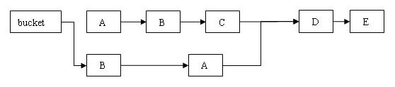

### 面试问题：

* java跨平台的原理：

  java虚拟机是一个可以执行Java字节码的虚拟机进程。Java源文件被编译成能被Java虚拟机执行的字节码文件。

  java通过不同的系统、不同版本、不同位数的java虚拟机，来屏蔽不同指令集差异而对外提供统一的接口。

* java中int占几个字节？

  4个，32位

* 面向对象的特征有哪些方面？

  封装：将对象封装成一个高度自治和相对封闭的个体

  抽象：找出一些事物的相似之处和共性之处

  继承：可以在一个已经存在的类的基础之上来进行，例如遗产的继承

  多态：父类或接口定义的引用变量指向子类或具体实现的类，程序在调用时才动态绑定。

* 有了基本的数据类型，为什么还需要包装类型？

  装箱：在编译时会调用valueOf()方法来装箱

  拆箱：把包装类型转换为基本数据类型，调用xxxValue();

  java是一种面向对象的语言，而基本的数据类型，不具备面向对象的特性，比如null值。

* "=="和equals方法的区别：

  ==用来判断两个变量之间的值是否相等。基本数据类型直接比较值（包装类型会触发自动拆箱的过程），引用数据类型要比较对应的引用的内存首地址（对于包装类型，equals方法并不会进行类型转换）；

  equals用来比较两个对象的某些特征是否一样。举例：两个Person对象的名字(name)是否一样，若一样，则相等。

  ```java
  public static void main(String[] args) {

  		Integer a = 1;
  		Integer b = 2;
  		Integer c = 3;
  		Integer d = 3;
  		Integer e = 321;
  		Integer f = 321;
  		Long g = 3L;
  		Long h = 2L;

  		System.out.println(c == d);
  		System.out.println(e == f);
  		System.out.println(c == (a + b));
  		System.out.println(c.equals(a + b));
  		System.out.println(g == (a + b));
  		System.out.println(g.equals(a + b));
  		System.out.println(g.equals(a + h));
  	}
  ```

  ```java
  //输出结果
  true
  false
  true
  true
  true
  false
  true
  ```

* String和StringBuilder的区别，StringBuffer和StringBuilder的区别

  String是内容不可变的字符串，底层使用了一个不可变的字符数组（private final char []）

  而StringBuilder和StringBuffer采用可变字符数组（char [] value）

  拼接字符串：

  String进行拼接，String c= "a" + "b";

  StringBuilder或者StringBuffer，StringBuilder sb = new StringBuilder();

  sb.append("a");

  StringBuilder是线程不安全的，效率较高。而StringBuffer是线程安全的，效率较低。（内部采用synchronized来修饰append方法）

* java中的集合

  Collection和Map

  List是有序的，可以重复；

  Set是无序的，不可以重复；根据equals和hashcode判断。

* ArrayList和LinkedList的区别：

  ArrayList使用数组，LinkedList使用的是链表。

  数组查询比较快（有索引），插入和修改比较慢，数组在内存中是一块连续的内存，如果插入或删除，需要移动内存。

  链表查询比较慢（需要从头部开始），插入和修改比较快（只需改变引用指向即可），链表不要求内存连续。

  ArrayList使用在查询比较多，而插入和删除比较少。而LinkedList相反。

* HashMap和HashTable的区别：

  HashMap和HashTable都使用哈希表来存储键值对。在数据结构上是基本相同的，都创建了一个继承自Map.Entry的私有的内部类Entry，每一个Entry对象表示存储在哈希表中的一个键值对。

  Entry对象唯一表示一个键值对，有四个属性：

  -K key 键对象
  -V value 值对象
  -int hash 键对象的hash值
  -Entry entry 指向链表中下一个Entry对象，可为null，表示当前Entry对象在链表尾部

  初始容量大小和每次扩充容量大小的不同：

  ```java
  以下代码及注释来自java.util.HashTable
   
  // 哈希表默认初始大小为11
  public Hashtable() {
      this(11, 0.75f);
  }
   
  protected void rehash() {
      int oldCapacity = table.length;
      Entry<K,V>[] oldMap = table;
   
      // 每次扩容为原来的2n+1
      int newCapacity = (oldCapacity << 1) + 1;
      // ...
  }
   
   
  以下代码及注释来自java.util.HashMap
   
  // 哈希表默认初始大小为2^4=16
  static final int DEFAULT_INITIAL_CAPACITY = 1 << 4; // aka 16
   
  void addEntry(int hash, K key, V value, int bucketIndex) {
      // 每次扩充为原来的2n 
      if ((size >= threshold) && (null != table[bucketIndex])) {
         resize(2 * table.length);
  }
  ```

  HashTable默认的初始大小为11，之后每次扩充为原来的2n+1。HashMap默认的初始化大小为16，之后每次扩充为原来的2倍。

  如果在创建时给定了初始化大小，那么HashTable会直接使用你给定的大小，而HashMap会将其扩充为2的幂次方大小。

  ​

  HashMap可以把null作为key或者value，而HashTable是不可以的；

  ```java
  以下代码及注释来自java.util.HashTable
   
  public synchronized V put(K key, V value) {
   
      // 如果value为null，抛出NullPointerException
      if (value == null) {
          throw new NullPointerException();
      }
   
      // 如果key为null，在调用key.hashCode()时抛出NullPointerException
   
      // ...
  }
   
   
  以下代码及注释来自java.util.HasMap
   
  public V put(K key, V value) {
      if (table == EMPTY_TABLE) {
          inflateTable(threshold);
      }
      // 当key为null时，调用putForNullKey特殊处理
      if (key == null)
          return putForNullKey(value);
      // ...
  }
   
  private V putForNullKey(V value) {
      // key为null时，放到table[0]也就是第0个bucket中
      for (Entry<K,V> e = table[0]; e != null; e = e.next) {
          if (e.key == null) {
              V oldValue = e.value;
              e.value = value;
              e.recordAccess(this);
              return oldValue;
          }
      }
      modCount++;
      addEntry(0, null, value, 0);
      return null;
  }
  ```

  HashMap是线程不安全的，效率较高，HashTable是线程安全的，效率较低；

  ```java
  以下代码及注释来自java.util.HashTable
   
  public synchronized V get(Object key) {
      Entry tab[] = table;
      int hash = hash(key);
      int index = (hash & 0x7FFFFFFF) % tab.length;
      for (Entry<K,V> e = tab[index] ; e != null ; e = e.next) {
          if ((e.hash == hash) && e.key.equals(key)) {
              return e.value;
          }
      }
      return null;
  }
   
  public Set<K> keySet() {
      if (keySet == null)
          keySet = Collections.synchronizedSet(new KeySet(), this);
      return keySet;
  }
  ```

* ​实现拷贝文件使用字节流还是字符流？

  若不确定文件的类型（如可能有图片、音频等），使用字节流，若确定文件的类型是文本，使用字符流。

* **HashMap的实现原理：**

  哈希表：哈希表是一种根据关键码去寻找值的数据映射结构。就像字典那样。

  哈希冲突：对于任意给定的对象，只要它的hashCode()返回值相同，那么用Hash算法得到的hash值一定相同。

  Hash算法：就是把任意长度的输入（又叫做预映射， pre-image），通过散列算法，变换成固定长度的输出，该输出就是散列值。

  解决冲突的办法：

  链地址法：如果遇到冲突，就在原地址上新建一个空间，然后以链表结点的形式插入到该空间。

  

  当程序试图存放一个key-value的时候，程序首先会根据key得到它的hashCode，然后通过hash算法获得对应的hash值，然后再获取指定hash值在对应的table中的索引。

  如果两个Entry的hashCode相等，那么程序会通过equals方法比较key的值：返回true，则新添加的Entry的value将覆盖集合中原有的value，但是key不会覆盖；返回false，则新添加的Entry将与原有Entry形成Entry链，而且新添加的Entry位于Entry链的头部。

  hashMap类的put操作的源代码：

  ```java
  public V put(K key, V value) 
  { 
      // 如果 key 为 null，调用 putForNullKey 方法进行处理
      if (key == null) 
          return putForNullKey(value); 
      // 根据 key 的 keyCode 计算 Hash 值
      int hash = hash(key.hashCode()); 
      // 搜索指定 hash 值在对应 table 中的索引
      int i = indexFor(hash, table.length);
      // 如果 i 索引处的 Entry 不为 null，通过循环不断遍历 e 元素的下一个元素
      for (Entry<K,V> e = table[i]; e != null; e = e.next) 
      { 
          Object k; 
          // 找到指定 key 与需要放入的 key 相等（hash 值相同
          // 通过 equals 比较放回 true）
          if (e.hash == hash && ((k = e.key) == key 
              || key.equals(k))) 
          { 
              V oldValue = e.value; 
              e.value = value; 
              e.recordAccess(this); 
              return oldValue; 
          } 
      } 
      // 如果 i 索引处的 Entry 为 null，表明此处还没有 Entry 
      modCount++; 
      // 将 key、value 添加到 i 索引处
      addEntry(hash, key, value, i); 
      return null; 
  }
  ```

  其中的hash算法：

  ```java
  static final int hash(Object key) {
      int h;
      return (key == null) ? 0 : (h = key.hashCode()) ^ (h >>> 16);
  }
  ```

  其中计算table中的索引值：

  ```java
  static int indexFor(int h, int length) 
  { 
      //h 是得到的hash值
      //length表示bucket的个数
      return h & (length-1); 
  }
  ```

  用于添加key-value对的方法：

  ```java
  void addEntry(int hash, K key, V value, int bucketIndex) 
  { 
      // 获取指定 bucketIndex 索引处的 Entry 
      Entry<K,V> e = table[bucketIndex];     // ①
      // 将新创建的 Entry 放入 bucketIndex 索引处，并让新的 Entry 指向原来的 Entry 
      table[bucketIndex] = new Entry<K,V>(hash, key, value, e); 
      // 如果 Map 中的 key-value 对的数量超过了极限
      if (size++ >= threshold) 
          // 把 table 对象的长度扩充到 2 倍。
          resize(2 * table.length);    // ②
  }
  ```

  一个非常优雅的设计：系统总是将新添加的 Entry 对象放入 table 数组的 bucketIndex 索引处——如果 bucketIndex 索引处已经有了一个 Entry 对象，那新添加的 Entry 对象指向原有的 Entry 对象（产生一个 Entry 链），如果 bucketIndex 索引处没有 Entry 对象，也就是上面程序①号代码的 e 变量是 null，也就是新放入的 Entry 对象指向 null，也就是没有产生 Entry 链。

  HashMap的构造函数：

  ```java
  // 以指定初始化容量、负载因子创建 HashMap 
  public HashMap(int initialCapacity, float loadFactor) 
  { 
      // 初始容量不能为负数
      if (initialCapacity < 0) 
          throw new IllegalArgumentException( 
         "Illegal initial capacity: " + 
              initialCapacity); 
      // 如果初始容量大于最大容量，让出示容量
      if (initialCapacity > MAXIMUM_CAPACITY) 
          initialCapacity = MAXIMUM_CAPACITY; 
      // 负载因子必须大于 0 的数值
      if (loadFactor <= 0 || Float.isNaN(loadFactor)) 
          throw new IllegalArgumentException( 
          loadFactor); 
      // 计算出大于 initialCapacity 的最小的 2 的 n 次方值。
      int capacity = 1; 
      while (capacity < initialCapacity) 
          capacity <<= 1; 
      this.loadFactor = loadFactor; 
      // 设置容量极限等于容量 * 负载因子
      threshold = (int)(capacity * loadFactor); 
      // 初始化 table 数组
      table = new Entry[capacity];            // ①
      init(); 
  }
  ```

  上面代码中代码包含了一个简洁的代码实现：找出大于 initialCapacity 的、最小的 2 的 n 次方值，并将其作为 HashMap 的实际容量（由 capacity 变量保存）。例如给定 initialCapacity 为 10，那么该 HashMap 的实际容量就是 16。

  HashMap的读取实现get(Object key)：

  ```java
  public V get(Object key) 
  { 
      // 如果 key 是 null，调用 getForNullKey 取出对应的 value 
      if (key == null) 
          return getForNullKey(); 
      // 根据该 key 的 hashCode 值计算它的 hash 码
      int hash = hash(key.hashCode()); 
      // 直接取出 table 数组中指定索引处的值，
      for (Entry<K,V> e = table[indexFor(hash, table.length)]; 
          e != null; 
          // 搜索该 Entry 链的下一个 Entr 
          e = e.next)         // ①
      { 
          Object k; 
          // 如果该 Entry 的 key 与被搜索 key 相同
          if (e.hash == hash && ((k = e.key) == key 
              || key.equals(k))) 
              return e.value; 
      } 
      return null; 
  }
  ```

  从上面代码中可以看出，如果 HashMap 的每个 bucket 里只有一个 Entry 时，HashMap 可以根据索引、快速地取出该 bucket 里的 Entry；

  在发生“Hash 冲突”的情况下，单个 bucket 里存储的不是一个 Entry，而是一个 Entry 链，系统只能必须按顺序遍历每个 Entry，直到找到想搜索的 Entry 为止——如果恰好要搜索的 Entry 位于该 Entry 链的最末端（该 Entry 是最早放入该 bucket 中），那系统必须循环到最后才能找到该元素。

  小结：

  HashMap 在底层将 key-value 当成一个整体进行处理，这个整体就是一个 Entry 对象。HashMap 底层采用一个 Entry[] 数组来保存所有的 key-value 对，当需要存储一个 Entry 对象时，会根据 Hash 算法来决定其存储位置；当需要取出一个 Entry 时，也会根据 Hash 算法找到其存储位置，直接取出该 Entry。

  扩容resize()：

  如果目前的bucket的占用程度已经超过了Load Factor所希望的比例，那么就会发生resize();

  ```java
  if (size++ >= threshold) 
          // 把 table 对象的长度扩充到 2 倍。
          resize(2 * table.length); 
  ```

  size：该变量保存了该 HashMap 中所包含的 key-value 对的数量。

  threshold：该变量包含了 HashMap 能容纳的 key-value 对的极限，它的值等于 HashMap 的容量乘以负载因子（load factor）。

  resize()的源码：

  ```java
  final Node<K,V>[] resize() {
      Node<K,V>[] oldTab = table;
      int oldCap = (oldTab == null) ? 0 : oldTab.length;
      int oldThr = threshold;
      int newCap, newThr = 0;
      if (oldCap > 0) {
          // 超过最大值就不再扩充了，就只好随你碰撞去吧
          if (oldCap >= MAXIMUM_CAPACITY) {
              threshold = Integer.MAX_VALUE;
              return oldTab;
          }
          // 没超过最大值，就扩充为原来的2倍
          else if ((newCap = oldCap << 1) < MAXIMUM_CAPACITY &&
                   oldCap >= DEFAULT_INITIAL_CAPACITY)
              newThr = oldThr << 1; // double threshold
      }
      else if (oldThr > 0) // initial capacity was placed in threshold
          newCap = oldThr;
      else {               // zero initial threshold signifies using defaults
          newCap = DEFAULT_INITIAL_CAPACITY;
          newThr = (int)(DEFAULT_LOAD_FACTOR * DEFAULT_INITIAL_CAPACITY);
      }
      // 计算新的resize上限
      if (newThr == 0) {
          float ft = (float)newCap * loadFactor;
          newThr = (newCap < MAXIMUM_CAPACITY && ft < (float)MAXIMUM_CAPACITY ?
                    (int)ft : Integer.MAX_VALUE);
      }
      threshold = newThr;
      @SuppressWarnings({"rawtypes","unchecked"})
          Node<K,V>[] newTab = (Node<K,V>[])new Node[newCap];
      table = newTab;
      if (oldTab != null) {
          // 把每个bucket都移动到新的buckets中
          for (int j = 0; j < oldCap; ++j) {
              Node<K,V> e;
              if ((e = oldTab[j]) != null) {
                  oldTab[j] = null;
                  if (e.next == null)
                      newTab[e.hash & (newCap - 1)] = e;
                  else if (e instanceof TreeNode)
                      ((TreeNode<K,V>)e).split(this, newTab, j, oldCap);
                  else { // preserve order
                      Node<K,V> loHead = null, loTail = null;
                      Node<K,V> hiHead = null, hiTail = null;
                      Node<K,V> next;
                      do {
                          next = e.next;
                          // 原索引
                          if ((e.hash & oldCap) == 0) {
                              if (loTail == null)
                                  loHead = e;
                              else
                                  loTail.next = e;
                              loTail = e;
                          }
                          // 原索引+oldCap
                          else {
                              if (hiTail == null)
                                  hiHead = e;
                              else
                                  hiTail.next = e;
                              hiTail = e;
                          }
                      } while ((e = next) != null);
                      // 原索引放到bucket里
                      if (loTail != null) {
                          loTail.next = null;
                          newTab[j] = loHead;
                      }
                      // 原索引+oldCap放到bucket里
                      if (hiTail != null) {
                          hiTail.next = null;
                          newTab[j + oldCap] = hiHead;
                      }
                  }
              }
          }
      }
      return newTab;
  }
  ```

  当超过限制的时候会resize，然而又因为我们使用的是2次幂的扩展(指长度扩为原来2倍)，所以，元素的位置要么是在原位置，要么是在原位置再移动2次幂的位置。

  例如我们从16扩展为32时，具体的变化如下所示：
  

  因此元素在重新计算hash之后，因为n变为2倍，那么n-1的mask范围在高位多1bit(红色)，因此新的index就会发生这样的变化：
  

  因此，我们在扩充HashMap的时候，不需要重新计算hash，只需要看看原来的hash值新增的那个bit是1还是0就好了，是0的话索引没变，是1的话索引变成“原索引+oldCap”。

  resize方法存在线程不安全问题：

  当重新调整HashMap大小的时候，确实存在条件竞争，因为如果两个线程都发现HashMap需要重新调整大小了，它们会同时试着调整大小。**在调整大小的过程中，存储在链表中的元素的次序会反过来，因为移动到新的bucket位置的时候，HashMap并不会将元素放在链表的尾部，而是放在头部，这是为了避免尾部遍历(tail traversing)。**如果条件竞争发生了，那么就死循环了。

  尽量使用String，Integer这样的wrapper类作为键。

  因为String是不可变的，也是final的，而且已经重写了equals()和hashCode()方法了。其他的wrapper类也有这个特点。不可变性是必要的，因为为了要计算hashCode()，就要防止键值改变，如果键值在放入时和获取时返回不同的hashcode的话，那么就不能从HashMap中找到你想要的对象。

  如果使用自定义的对象作为键，必须重写equals()和hashCode()方法。

* **ConcurrentHashMap实现原理：**

  ConcurrentHashMap 类中包含两个静态内部类 HashEntry 和 Segment。HashEntry 用来封装映射表的键 / 值对；

  Segment 用来充当锁的角色，每个 Segment 对象守护整个散列映射表的若干个桶。每个桶是由若干个 HashEntry 对象链接起来的链表。

  一个 ConcurrentHashMap 实例中包含由若干个 Segment 对象组成的数组。

  HashEntry类：

  HashEntry 用来封装散列映射表中的键值对。在 HashEntry 类中，key，hash 和 next 域都被声明为 final 型，value 域被声明为 volatile 型。

  ```java
  static final class HashEntry<K,V> { 
         final K key;                       // 声明 key 为 final 型
         final int hash;                   // 声明 hash 值为 final 型 
         volatile V value;                 // 声明 value 为 volatile 型
         final HashEntry<K,V> next;      // 声明 next 为 final 型 
   
         HashEntry(K key, int hash, HashEntry<K,V> next, V value) { 
             this.key = key; 
             this.hash = hash; 
             this.next = next; 
             this.value = value; 
         } 
  }
  ```

  在 ConcurrentHashMap 中，在散列时如果产生“碰撞”，将采用“分离链接法”来处理“碰撞”：把“碰撞”的 HashEntry 对象链接成一个链表。

  由于 HashEntry 的 next 域为 final 型，所以新节点只能在链表的表头处插入。

  在一个空桶中插入三个HashEntry（A、B、C）后桶的结构：

  

  特别注意：由于只能在表头插入，所以链表中的节点的顺序和插入的顺序相反。

  Segment类：

  Segment 类继承于 ReentrantLock 类，从而使得 Segment 对象能充当锁的角色。每个 Segment 对象用来守护其（成员对象 table 中）包含的若干个桶。

  table 是一个由 HashEntry 对象组成的数组。table 数组的每一个数组成员就是散列映射表的一个桶。

  ```java
  static final class Segment<K,V> extends ReentrantLock implements Serializable { 
         /** 
          * 在本 segment 范围内，包含的 HashEntry 元素的个数这样当需要更新计数器时，不用锁定整个 ConcurrentHashMap
          * 该变量被声明为 volatile 型
          */ 
         transient volatile int count; 
   
         /** 
          * table 被更新的次数
          */ 
         transient int modCount; 
   
         /** 
          * 当 table 中包含的 HashEntry 元素的个数超过本变量值时，触发 table 的再散列
          */ 
         transient int threshold; 
   
         /** 
          * table 是由 HashEntry 对象组成的数组
          * 如果散列时发生碰撞，碰撞的 HashEntry 对象就以链表的形式链接成一个链表
          * table 数组的数组成员代表散列映射表的一个桶
          * 每个 table 守护整个 ConcurrentHashMap 包含桶总数的一部分
          * 如果并发级别为 16，table 则守护 ConcurrentHashMap 包含的桶总数的 1/16 
          */ 
         transient volatile HashEntry<K,V>[] table; 
   
         /** 
          * 装载因子
          */ 
         final float loadFactor; 
   
         Segment(int initialCapacity, float lf) { 
             loadFactor = lf; 
             setTable(HashEntry.<K,V>newArray(initialCapacity)); 
         } 
   
         /** 
          * 设置 table 引用到这个新生成的 HashEntry 数组
          * 只能在持有锁或构造函数中调用本方法
          */ 
         void setTable(HashEntry<K,V>[] newTable) { 
             // 计算临界阀值为新数组的长度与装载因子的乘积
             threshold = (int)(newTable.length * loadFactor); 
             table = newTable; 
         } 
   
         /** 
          * 根据 key 的散列值，找到 table 中对应的那个桶（table 数组的某个数组成员）
          */ 
         HashEntry<K,V> getFirst(int hash) { 
             HashEntry<K,V>[] tab = table; 
             // 把散列值与 table 数组长度减 1 的值相“与”，
  // 得到散列值对应的 table 数组的下标
             // 然后返回 table 数组中此下标对应的 HashEntry 元素
             return tab[hash & (tab.length - 1)]; 
         } 
  }
  ```

  依次插入A、B、C三个HashEntry节点后，Segment的结构示意图：

  

  ConcurrentHashMap类：

  ```java
  public class ConcurrentHashMap<K, V> extends AbstractMap<K, V> implements ConcurrentMap<K, V>, Serializable {

  		/**
  		 * 散列映射表的默认初始容量为 16，即初始默认为 16 个桶 在构造函数中没有指定这个参数时，使用本参数
  		 */
  		static final int DEFAULT_INITIAL_CAPACITY = 16;

  		/**
  		 * 散列映射表的默认装载因子为 0.75，该值是 table 中包含的 HashEntry 元素的个数与 table 数组长度的比值 当 table 中包含的
  		 * HashEntry 元素的个数超过了 table 数组的长度与装载因子的乘积时， 将触发 再散列 在构造函数中没有指定这个参数时，使用本参数
  		 */
  		static final float DEFAULT_LOAD_FACTOR = 0.75f;

  		/**
  		 * 散列表的默认并发级别为 16。该值表示当前更新线程的估计数 在构造函数中没有指定这个参数时，使用本参数
  		 */
  		static final int DEFAULT_CONCURRENCY_LEVEL = 16;

  		/**
  		 * segments 的掩码值 key 的散列码的高位用来选择具体的 segment
  		 */
  		final int segmentMask;

  		/**
  		 * 偏移量
  		 */
  		final int segmentShift;

  		/**
  		 * 由 Segment 对象组成的数组
  		 */
  		final Segment<K, V>[] segments;

  		/**
  		 * 创建一个带有指定初始容量、加载因子和并发级别的新的空映射。
  		 */
  		public ConcurrentHashMap(int initialCapacity, float loadFactor, int concurrencyLevel) {
  			if (!(loadFactor > 0) || initialCapacity < 0 || concurrencyLevel <= 0)
  				throw new IllegalArgumentException();

  			if (concurrencyLevel > MAX_SEGMENTS)
  				concurrencyLevel = MAX_SEGMENTS;

  			// 寻找最佳匹配参数（不小于给定参数的最接近的 2 次幂）
  			int sshift = 0;
  			int ssize = 1;
  			while (ssize < concurrencyLevel) {
  				++sshift;
  				ssize <<= 1;
  			}
  			segmentShift = 32 - sshift; // 偏移量值
  			segmentMask = ssize - 1; // 掩码值
  			this.segments = Segment.newArray(ssize); // 创建数组

  			if (initialCapacity > MAXIMUM_CAPACITY)
  				initialCapacity = MAXIMUM_CAPACITY;
  			int c = initialCapacity / ssize;
  			if (c * ssize < initialCapacity)
  				++c;
  			int cap = 1;
  			while (cap < c)
  				cap <<= 1;

  			// 依次遍历每个数组元素
  			for (int i = 0; i < this.segments.length; ++i)
  				// 初始化每个数组元素引用的 Segment 对象
  				this.segments[i] = new Segment<K, V>(cap, loadFactor);
  		}

  		/**
  		 * 创建一个带有默认初始容量 (16)、默认加载因子 (0.75) 和 默认并发级别 (16) 的空散列映射表。
  		 */
  		public ConcurrentHashMap() {
  			// 使用三个默认参数，调用上面重载的构造函数来创建空散列映射表
  			this(DEFAULT_INITIAL_CAPACITY, DEFAULT_LOAD_FACTOR, DEFAULT_CONCURRENCY_LEVEL);
  		}

  	}
  ```

  在这里，有三个非常重要的参数：**初始容量**、**负载因子** 和 **并发级别**，这三个参数是影响ConcurrentHashMap性能的重要参数。

  从上述源码可以看出，ConcurrentHashMap也正是通过initialCapacity、loadFactor和concurrencyLevel这三个参数进行构造并初始化segments数组、段偏移量segmentShift、段掩码segmentMask和每个segment的。

  ​

  ```java
  int sshift = 0;
  int ssize = 1;
  while (ssize < concurrencyLevel) {
      ++sshift;
      ssize <<= 1;
  }
  this.segmentShift = 32 - sshift;
  this.segmentMask = ssize - 1;
  this.segments = Segment.newArray(ssize);
  ```

  这段代码：

  segmentShift（如需加入某元素，将它分配到某个segment需移动的位数）；

  segmentMask（此掩码用于计算分配到哪个segment）

  concurrencyLevel可以看为分多少个segment，即segment[]的长度，就是**大于或等于concurrencyLevel的最小的2的N次方**。这样的好处是是为了方便采用位运算来加速进行元素的定位。假如concurrencyLevel等于14，15或16，ssize都会等于16；

  segmentMask这个掩码后面被用来跟hash值的高位做&操作，从而确定分配到哪个segment；

  **sshift的大小，即是N次方的N**，每while循环一次，sshift就增加1，那么segmentShift的值就等于32减去n，而segmentMask就等于2的n次方减去1；

  而segmentShift后面用来为hash值右移的位数，从而获取hash的高多少位来做&运算。

  ```java
  int c = initialCapacity / ssize;
  if (c * ssize < initialCapacity)
      ++c;
  int cap = MIN_SEGMENT_TABLE_CAPACITY;
  while (cap < c)
      cap <<= 1;
  ```

  这段是求cap（segment中包含的table数组的大小），这个cap的大小是2的N次方。

  ConcurrentHashMap结构示意图：

  

  用分离锁实现多个线程之间的并发写操作：

  Put方法的实现：

  ```java
  public V put(K key, V value) {
  		Segment<K, V> s;
  		
  		//ConcurrentHashMap 中不允许用 null 作为映射值
  		if (value == null)
  			throw new NullPointerException();
  		
  		// 计算key的hash值：
  		int hash = hash(key);
  		
  		// 将散列值右移 segmentShift 个位，并在高位填充 0 
     		// 然后把得到的值与 segmentMask 相“与”
  		// 从而得到 hash 值对应的 segments 数组的下标值
  		int j = (hash >>> segmentShift) & segmentMask;
  		
  		// 使用CAS方式，从Segment[]中获取j角标下的Segment对象,并判断是否存在：
  		if ((s = (Segment<K, V>) UNSAFE.getObject(segments, (j << SSHIFT) + SBASE)) == null)
  			
  			// 如果在Segment[]中的j角标处没有元素，则在j角标处新建元素---Segment对象；
  			s = ensureSegment(j);
  		
  		// 底层使用Segment对象的put方法：
  		return s.put(key, hash, value, false);
  	}
  ```

  根据hash值向右无符号移segmentShift位，然后和segmentMask进行"与"操作就可以定位到特定的段。

  在这里，假设Segment的数量(即segments数组的长度)是2的n次方(Segment的数量总是2的倍数，具体见构造函数的实现)，那么segmentShift的值就是32-n(hash值的位数是32)，而segmentMask的值就是2^n-1（写成二进制的形式就是n个1）。

  进一步地，我们就可以得出以下结论：**根据key的hash值的高n位就可以确定元素到底在哪一个Segment中。**

  在Segment中执行具体的put操作：

  ```java
  V put(K key, int hash, V value, boolean onlyIfAbsent) { 
             lock();  // 加锁，这里是锁定某个 Segment 对象而非整个 ConcurrentHashMap 
             try { 
                 int c = count; 
   
                 if (c++ > threshold)     // 如果超过再散列的阈值
                     rehash();              // 执行再散列，table 数组的长度将扩充一倍
   
                 HashEntry<K,V>[] tab = table; 
                 // 把散列码值与 table 数组的长度减 1 的值相“与”
                 // 得到该散列码对应的 table 数组的下标值
                 int index = hash & (tab.length - 1); 
                 // 找到散列码对应的具体的那个桶
                 HashEntry<K,V> first = tab[index]; 
   
                 HashEntry<K,V> e = first; 
                 while (e != null && (e.hash != hash || !key.equals(e.key))) 
                     e = e.next; 
   
                 V oldValue; 
                 if (e != null) {            // 如果键 / 值对以经存在
                     oldValue = e.value; 
                     if (!onlyIfAbsent) 
                         e.value = value;    // 设置 value 值
                 } 
                 else {                        // 键 / 值对不存在 
                     oldValue = null; 
                     ++modCount;         // 要添加新节点到链表中，所以 modCont 要加 1  
                     // 创建新节点，并添加到链表的头部 
                     tab[index] = new HashEntry<K,V>(key, hash, first, value); 
                     count = c;               // 写 count 变量
                 } 
                 return oldValue; 
             } finally { 
                 unlock();                     // 解锁
             } 
         }
  ```

  这里的加锁操作是针对（键的 hash 值对应的）某个具体的 Segment，锁定的是该 Segment 而不是整个 ConcurrentHashMap。因为插入键 / 值对操作只是在这个 Segment 包含的某个桶中完成，不需要锁定整个ConcurrentHashMap。

  这样的好处就是，当我们进行插入操作时，只要插入的不是同一个Segment对象，那么并发线程就不需要进行等待操作，在保证安全的同时，又极大的提高了并发性能。

  remove操作：

  ```java
  V remove(Object key, int hash, Object value) { 
             lock();         // 加锁
             try{ 
                 int c = count - 1; 
                 HashEntry<K,V>[] tab = table; 
                 // 根据散列码找到 table 的下标值
                 int index = hash & (tab.length - 1); 
                 // 找到散列码对应的那个桶
                 HashEntry<K,V> first = tab[index]; 
                 HashEntry<K,V> e = first; 
                 while(e != null&& (e.hash != hash || !key.equals(e.key))) 
                     e = e.next; 
   
                 V oldValue = null; 
                 if(e != null) { 
                     V v = e.value; 
                     if(value == null|| value.equals(v)) { // 找到要删除的节点
                         oldValue = v; 
                         ++modCount; 
                         // 所有处于待删除节点之后的节点原样保留在链表中
                         // 所有处于待删除节点之前的节点被克隆到新链表中
                         HashEntry<K,V> newFirst = e.next;// 待删节点的后继结点
                         for(HashEntry<K,V> p = first; p != e; p = p.next) 
                             newFirst = new HashEntry<K,V>(p.key, p.hash, 
                                                           newFirst, p.value); 
                         // 把桶链接到新的头结点
                         // 新的头结点是原链表中，删除节点之前的那个节点
                         tab[index] = newFirst; 
                         count = c;      // 写 count 变量
                     } 
                 } 
                 return oldValue; 
             } finally{ 
                 unlock();               // 解锁
             } 
         }
  ```

  首先根据散列码找到具体的链表；

  然后遍历这个链表找到要删除的节点；

  最后把待删除节点之后的所有节点原样保留在新链表中，把待删除节点之前的每个节点克隆到新链表中。

  假设写线程执行 remove 操作，要删除链表的 C 节点，另一个读线程同时正在遍历这个链表：

  删除之前的原链表：

  

  执行删除之后的新链表：

  

  从上图可以看出，删除节点 C 之后的所有节点原样保留到新链表中；删除节点 C 之前的每个节点被克隆到新链表中，**注意：它们在新链表中的链接顺序被反转了。**因此，**在执行remove操作时，原始链表并没有被修改，也就是说，读线程不会受同时执行 remove 操作的并发写线程的干扰。**

  Get操作：

  ConcurrentHashMap 中，每个 Segment 都有一个变量 count。它用来统计 Segment 中的 HashEntry 的个数。这个变量被声明为 volatile。

  ```java

  ```

  ```java
  V get(Object key, int hash) { 
             if(count != 0) {       // 首先读 count 变量
                 HashEntry<K,V> e = getFirst(hash); 
                 while(e != null) { 
                     if(e.hash == hash && key.equals(e.key)) { 
                         V v = e.value; 
                         if(v != null)            
                             return v; 
                         // 如果读到 value 域为 null，说明发生了重排序，加锁后重新读取
                         return readValueUnderLock(e); 
                     } 
                     e = e.next; 
                 } 
             } 
             return null; 
         }
  ```

  在获取操作中，获取Segment对象和HashEntry对象，使用了不同的计算规则，其目的主要为了避免散列后的值一样，尽可能将元素分散开来。

  ```java
  hash >>> segmentShift) & segmentMask　　 // 定位Segment所使用的hash算法
  int index = hash & (tab.length - 1);　　 // 定位HashEntry所使用的hash算法
  ```

  ​

  ConcurrentHashMap不同于HashMap，它既不允许key值为null，也不允许value值为null。但是，此处怎么会存在键值对存在且的Value值为null的情形呢？

  JDK官方给出的解释是，这种情形发生的场景是：初始化HashEntry时发生的指令重排序导致的，也就是在HashEntry初始化完成之前便返回了它的引用。这时，JDK给出的解决之道就是加锁重读。

  ```java
  V readValueUnderLock(HashEntry<K,V> e) {
              lock();
              try {
                  return e.value;
              } finally {
                  unlock();
              }
          }
  ```

  根据 Java 内存模型，对 同一个 volatile 变量的写 / 读操作可以确保：写线程写入的值，能够被之后未加锁的读线程“看到”。

  总结：

  ConcurrentHashMap读操作不需要加锁原因：

  - **用HashEntery对象的不变性来降低读操作对加锁的需求；**
  - **用Volatile变量协调读写线程间的内存可见性；**
  - **若读时发生指令重排序现象，则加锁重读；**

  size()方法：

  想要知道整个ConcurrentHashMap中的元素数量，就必须统计Segment对象下HashEntry[]中元素的个数。在Segment对象中有一个count属性，它是负责记录Segment对象中到底有多少个HashEntry的。当调用put()时，每增加一个元素，都会对count进行一次++。

  size方法主要思路是先在没有锁的情况下对所有段大小求和，这种求和策略最多执行RETRIES_BEFORE_LOCK次(默认是两次)：在没有达到RETRIES_BEFORE_LOCK之前，求和操作会不断尝试执行（这是因为遍历过程中可能有其它线程正在对已经遍历过的段进行结构性更新）；在超过RETRIES_BEFORE_LOCK之后，如果还不成功就在持有所有段锁的情况下再对所有段大小求和。

  Segment包含一个modCount成员变量，在会引起段发生结构性改变的所有操作(put操作、 remove操作和clean操作)里，都会将变量modCount进行加1，因此，**JDK只需要在统计size前后比较modCount是否发生变化就可以得知容器的大小是否发生变化。**

  ​

  ```java
  public int size() {
          final Segment<K,V>[] segments = this.segments;
          long sum = 0;
          long check = 0;
          int[] mc = new int[segments.length];
          // Try a few times to get accurate count. On failure due to
          // continuous async changes in table, resort to locking.
          for (int k = 0; k < RETRIES_BEFORE_LOCK; ++k) {
              check = 0;
              sum = 0;
              int mcsum = 0;
              for (int i = 0; i < segments.length; ++i) {
                  sum += segments[i].count;   
                  mcsum += mc[i] = segments[i].modCount;  // 在统计size时记录modCount
              }
              if (mcsum != 0) {
                  for (int i = 0; i < segments.length; ++i) {
                      check += segments[i].count;
                      if (mc[i] != segments[i].modCount) {  // 统计size后比较各段的modCount是否发生变化
                          check = -1; // force retry
                          break;
                      }
                  }
              }
              if (check == sum)// 如果统计size前后各段的modCount没变，且两次得到的总数一致，直接返回
                  break;
          }
          if (check != sum) { // Resort to locking all segments  // 加锁统计
              sum = 0;
              for (int i = 0; i < segments.length; ++i)
                  segments[i].lock();
              for (int i = 0; i < segments.length; ++i)
                  sum += segments[i].count;
              for (int i = 0; i < segments.length; ++i)
                  segments[i].unlock();
          }
          if (sum > Integer.MAX_VALUE)
              return Integer.MAX_VALUE;
          else
              return (int)sum;
      }
  ```

  rehash()操作：

  在ConcurrentHashMap中使用put操作插入Key/Value对之前，首先会检查本次插入会不会导致Segment中节点数量超过阈值threshold，如果会，那么就先对Segment进行扩容和重哈希操作。**特别需要注意的是，ConcurrentHashMap的重哈希实际上是对ConcurrentHashMap的某个段的重哈希，因此ConcurrentHashMap的每个段所包含的桶位自然也就不尽相同。**

  ```java
  void rehash() {
              HashEntry<K,V>[] oldTable = table;    // 扩容前的table
              int oldCapacity = oldTable.length;
              if (oldCapacity >= MAXIMUM_CAPACITY)   // 已经扩到最大容量，直接返回
                  return;

              // 新创建一个table，其容量是原来的2倍
              HashEntry<K,V>[] newTable = HashEntry.newArray(oldCapacity<<1);   
              threshold = (int)(newTable.length * loadFactor);   // 新的阈值
              int sizeMask = newTable.length - 1;     // 用于定位桶
              for (int i = 0; i < oldCapacity ; i++) {
                  // We need to guarantee that any existing reads of old Map can
                  //  proceed. So we cannot yet null out each bin.
                  HashEntry<K,V> e = oldTable[i];  // 依次指向旧table中的每个桶的链表表头

                  if (e != null) {    // 旧table的该桶中链表不为空
                      HashEntry<K,V> next = e.next;
                      int idx = e.hash & sizeMask;   // 重哈希已定位到新桶
                      if (next == null)    //  旧table的该桶中只有一个节点
                          newTable[idx] = e;
                      else {    
                          // Reuse trailing consecutive sequence at same slot
                          HashEntry<K,V> lastRun = e;
                          int lastIdx = idx;
                          for (HashEntry<K,V> last = next;
                               last != null;
                               last = last.next) {
                              int k = last.hash & sizeMask;
                              // 寻找k值相同的子链，该子链尾节点与父链的尾节点必须是同一个
                              if (k != lastIdx) {
                                  lastIdx = k;
                                  lastRun = last;
                              }
                          }

                          // JDK直接将子链lastRun放到newTable[lastIdx]桶中
                          newTable[lastIdx] = lastRun;

                          // 对该子链之前的结点，JDK会挨个遍历并把它们复制到新桶中
                          for (HashEntry<K,V> p = e; p != lastRun; p = p.next) {
                              int k = p.hash & sizeMask;
                              HashEntry<K,V> n = newTable[k];
                              newTable[k] = new HashEntry<K,V>(p.key, p.hash,
                                                               n, p.value);
                          }
                      }
                  }
              }
              table = newTable;   // 扩容完成
          }

  ```

  **由于扩容是按照2的幂次方进行的，所以扩展前在同一个桶中的元素，现在要么还是在原来的序号的桶里，或者就是原来的序号再加上一个2的幂次方，就这两种选择。**

  JDK6、7、8分别对ConcurrentHashMap的实现方式：

  [ConcurrentHashMap总结](https://my.oschina.net/hosee/blog/675884)

  [JDK8初始化临界值的具体实现](https://blog.csdn.net/lw_zj_ywn/article/details/78282905)

  ​

  ​

  ​