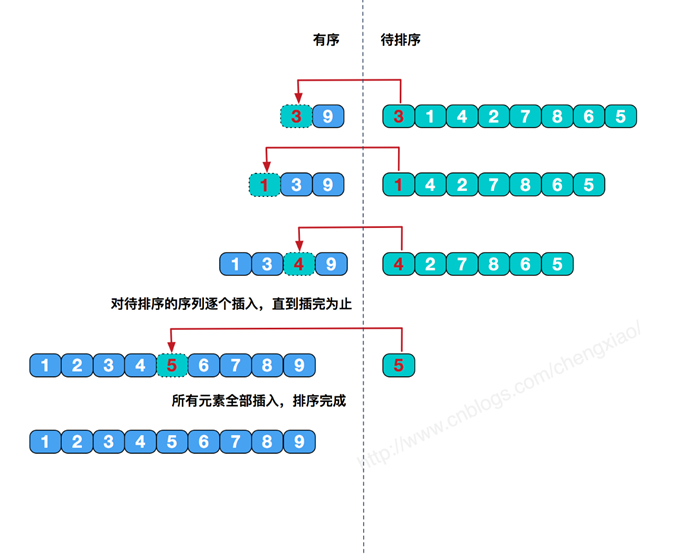

### 数据结构排序算法

直接插入排序：

基本思想：每一步将一个待排序的记录，插入到前面已经排好序的有序序列中去，直到插完所有元素为止。

图解：



算法中引进的附加记录R[0]称监视哨或哨兵(Sentinel)。

哨兵有两个作用：

① 进人查找(插入位置)循环之前，它保存了R[i]的副本，使不致于因记录后移而丢失R[i]的内容；

② 它的主要作用是：在查找循环中"监视"下标变量j是否越界。一旦越界(即j=0)，因为R[0].可以和自己比较，循环判定条件不成立使得查找循环结束，从而避免了在该循环内的每一次均要检测j是否越界(即省略了循环判定条件"j>=1")。

注意：

① 实际上，一切为简化边界条件而引入的附加结点(元素)均可称为哨兵。

【例如】单链表中的头结点实际上是一个哨兵

②引入哨兵后使得测试查找循环条件的时间大约减少了一半，所以对于记录数较大的文件节约的时间就相当可观。对于类似于排序这样使用频率非常高的算法，要尽可能地减少其运行时间。

```java
package sort;

public class InsertSort {

	public static void main(String[] args) {
		
		int[] array = { 10, 9, 8, 7, 6, 5, 4, 3, 2, 1 };
		// 因为第一个已经排好序了
		for (int i = 1; i < array.length; i++) {

//			for (int j = i; j > 0; j--) {
//				if (array[j] < array[j - 1]) {
//					int temp = array[j];
//					array[j] = array[j - 1];
//					array[j - 1] = temp;
//				} else {
//					break;
//				}
//			}
			// 优化的插入排序

			int k = array[i];
			int j;//保存k应该插入的位置
			for (j = i; j > 0; j--) {
				if (array[j - 1] > k) {
					array[j] = array[j - 1];
				} else {
					break;
				}
			}
			array[j] = k;
		}
		//打印数组
		for (int i : array) {
			System.out.print(" " + i);
		}
	}
}

```


二分法插入排序：

基本原理：在插入第i个元素时，对前面的0～i-1元素进行折半，先跟他们中间的那个元素比，如果小，则对前半再进行折半，否则对后半进行折半，直到left<right，然后再把第i个元素前1位与目标位置之间的所有元素后移，再把第i个元素放在目标位置上。

注：二分法没有排序，只有查找。所以当找到要插入的位置时。移动必须从最后一个记录开始，向后移动一位，再移动倒数第2位，直到要插入的位置的记录移后一位。（这句话知不知道都对做题无所谓）

图解：


希尔排序：

基本思想：把记录按下标的一定增量分组，对每组使用直接插入排序算法排序；随着增量逐渐减少，每组包含的关键词越来越多，当增量减至1时，整个文件恰被分成一组，算法便终止。

希尔排序在数组中采用跳跃式分组的策略，通过某个增量将数组元素划分为若干组，然后分组进行插入排序，随后逐步缩小增量，继续按组进行插入排序操作，直至增量为1。

我们来看下希尔排序的基本步骤，在此我们选择增量gap=length/2，缩小增量继续以gap = gap/2的方式，这种增量选择我们可以用一个序列来表示，{n/2,(n/2)/2...1}，称为增量序列。

因为直接插入排序在元素基本有序的情况下（接近最好情况），效率是很高的。一般我们在分割子序列是以5，3，1来分割。所以只需要将所有数字的个数除以2，即可得到组数d，即d=n/2

看下图实例：


原始数据：312,126,272,226,28,165,123


d=n/2             即d=7/2=3时的分组：

对这四个分组[312,226][126,28][272,165][226,123]用直接插入排序：123,28,165,226,126,272,312

注：123这个数字换了两次，先换到第4个位置，然后又换到第1个位置


d=d/2          即d=3/2=1时的分组：

对以上6个分组用直接插入排序：

28,123,126,165,226,272,312

由于d=1，所以结束排序，此时已经排好序了。

Shell插入排序算法是不稳定的排序算法

直接选择排序：

工作原理：

l  首先在未排序序列中找到最小（大）元素，存放到排序序列的起始位置；

l  然后，再从剩余未排序元素中继续寻找最小（大）元素，然后放到已排序序列的末尾。

l  以此类推，直到所有元素均排序完毕。

算法图解：


```java
package sort;

public class SelectSort {

	public static void main(String[] args) {
		
		int[] array = { 10, 9, 8, 7, 6, 5, 4, 3, 2, 1 };
		for (int i = 0; i < array.length; i++) {

			int minIndex = i;

			for (int j = i + 1; j < array.length; j++) {
				if (array[j] < array[minIndex]) {
					minIndex = j;
				}
			}
			if (minIndex != i) {
				int temp = array[minIndex];
				array[minIndex] = array[i];
				array[i] = temp;
			}
		}
        //打印数组
		for (int i : array) {
			System.out.print(" " + i);
		}
	}

}

```


冒泡排序：

基本思想：对相邻的元素进行两两比较，顺序相反则进行交换，这样，每一趟会将最小或最大的元素“浮”到顶端，最终达到完全有序。


冒泡排序算法的时间复杂度为O(n2),是一种稳定的排序算法。

```java
package sort;

public class BubbleSort {

	public static void main(String[] args) {	
		int[] array = { 10, 9, 8, 7, 6, 5, 4, 3, 2, 1 };
		//int[] array = SortUtils.randomArray(100);
		for(int i=0;i< array.length-1;i++) {
			for(int j = 0;j<array.length-1-i;j++) {
				if (array[j]>array[j+1]) {
					int temp = array[j];
					array[j] = array[j+1];
					array[j+1] = temp;
				}
			}
		}
        //打印数组
		for (int i : array) {
			System.out.print(" " + i);
		}	
	}
}


```


快速排序：

基本思想：当前待排序列分成两个部分、一个值。一个值：就是选定出一个值作为被比较的元素。两个部分：所有比该被选定元素大的部分都去该元素的右边，所有比被选定元素小的部分都去该元素的左边。这样我们就确定了该元素在这个待排序列中的位置，其实也就是我们已经将这个元素“排好了”。

具体过程：

我们选定一个被比较的元素，一般都是选第一个，即数组中第一个元素作为val，然后我们给出两个指针，一个指向最左边的元素，我们叫做low，一个指向最右边的元素，我们叫做high，即如下图所示：


一次快速排序就是有hight开始比较，因为我们是升序排列，所以，当hight指向的元素比val大的时候，hight所指向的元素的位置相对于val不应该发生改变，然后hight-1，即我们hight的位置向左移动一位，然后在比较hight元素和val，直到找到一个hight元素比val小，我们就将hight所指向的元素赋给low所指向的元素，记住，此时hight不动。然后我们去移动low元素，当low元素比val小的时候，low元素的位置相对于val不应该发生改变（当前为升序排列，小的就应该在左边），然后low+1,即low的位置向右移动一位，然后在继续比较low元素和val，直到找到一个low元素比val大，我们就将low所指向的元素赋给hight位置，记住，此时low不动，然后去移动hight元素，以此类推，直到low和hight的位置重合，即我们当前已经没有任何没有比较过的元素，即此位置就是val应该在的位置。一次快速排序结束。如下图所示：


一次快速排序完成后，我们只是找到了第一个元素的位置，所以我们采用递归的方法将左边的元素和右边的元素都采用快速排序进行对被选定元素的位置排序，直到整个序列只剩下一个元素，我们的快速排序就完成了。

例题：


答案选C，这道题很棒，要是做对的话，说明就会快速排序了。

归并排序：

可以参考 [图解排序算法(四)之归并排序](http://www.cnblogs.com/chengxiao/p/6194356.html)

基本原理：假设初始序列含有 n个记录，则可看成是 n个有序的子序列；每个子序列的长度为 1，然后两两归并，得到 én/2ù 个长度为 2 或 1 有序的子序列，再两两归并，... 如此重复，直至得到一个长度为 n 的有序序列为止。

归并就是将两个或两个以上的有序数据序列合并成一个有序数据序列的过程。

图解：


堆排序：

堆排序是利用堆这种数据结构而设计的一种排序算法，堆排序是一种选择排序，它的最坏，最好，平均时间复杂度均为O(nlogn)，它也是不稳定排序。首先简单了解下堆结构。


堆是具有以下性质的完全二叉树：每个结点的值都大于或等于其左右孩子结点的值，称为大顶堆；或者每个结点的值都小于或等于其左右孩子结点的值，称为小顶堆。如下图：

同时，我们对堆中的结点按层进行编号，将这种逻辑结构映射到数组中就是下面这个样子


该数组从逻辑上讲就是一个堆结构，我们用简单的公式来描述一下堆的定义就是：

大顶堆：arr[i] >= arr[2i+1] && arr[i] >=arr[2i+2]  

小顶堆：arr[i] <= arr[2i+1] && arr[i] <=arr[2i+2]  

ok，了解了这些定义。接下来，我们来看看堆排序的基本思想及基本步骤：

堆排序基本思想及步骤

堆排序的基本思想是：将待排序序列构造成一个大顶堆，此时，整个序列的最大值就是堆顶的根节点。将其与末尾元素进行交换，此时末尾就为最大值。然后将剩余n-1个元素重新构造成一个堆，这样会得到n个元素的次小值。如此反复执行，便能得到一个有序序列了

步骤一 构造初始堆。将给定无序序列构造成一个大顶堆（一般升序采用大顶堆，降序采用小顶堆)。

a.假设给定无序序列结构如下


 


2.此时我们从最后一个非叶子结点开始（叶结点自然不用调整，第一个非叶子结点arr.length/2-1=5/2-1=1，也就是下面的6结点），从左至右，从下至上进行调整。

4.找到第二个非叶节点4，由于[4,9,8]中9元素最大，4和9交换。


 


这时，交换导致了子根[4,5,6]结构混乱，继续调整，[4,5,6]中6最大，交换4和6。

此时，我们就将一个无需序列构造成了一个大顶堆。

步骤二将堆顶元素与末尾元素进行交换，使末尾元素最大。然后继续调整堆，再将堆顶元素与末尾元素交换，得到第二大元素。如此反复进行交换、重建、交换。


a.将堆顶元素9和末尾元素4进行交换

 


b.重新调整结构，使其继续满足堆定义

 


c.再将堆顶元素8与末尾元素5进行交换，得到第二大元素8.

 

后续过程，继续进行调整，交换，如此反复进行，最终使得整个序列有序


再简单总结下堆排序的基本思路：

a.将无需序列构建成一个堆，根据升序降序需求选择大顶堆或小顶堆;

b.将堆顶元素与末尾元素交换，将最大元素"沉"到数组末端;

c.重新调整结构，使其满足堆定义，然后继续交换堆顶元素与当前末尾元素，反复执行调整+交换步骤，直到整个序列有序。

各个排序算法的比较：


一些排序概念：

1.若待排序的序列中存在多个记录具有相同的键值，经过排序，这些记录的相对次序仍然保持不变，则称这种排序方法是稳定的，否则称为不稳定的。 

2.按照排序过程涉及的存储设备的不同，排序可分为内部排序和外部排序。 

3．对n个记录的表r[1..n]进行简单选择排序，所需进行的关键字间的比较次数为n(n-1)/2。

4.下述几种排序方法中，平均查找长度（ASL）最小的是

Ａ. 插入排序  Ｂ.快速排序 Ｃ. 归并排序 Ｄ. 选择排序