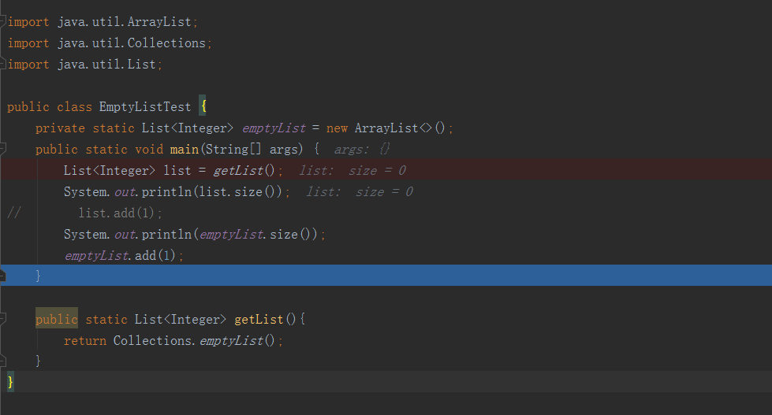
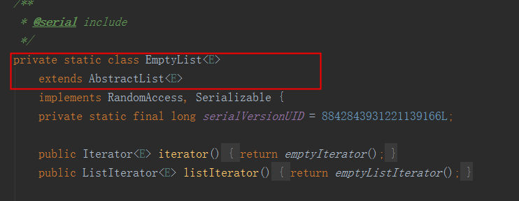
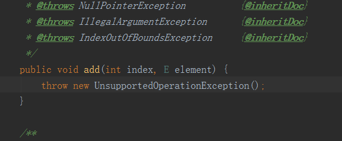

#### Java之Collections.emptyList()、emptySet()、emptyMap()的作用和好处以及要注意的地方

好处：

1. 如果你想new一个空的list，而这个list之后不会添加元素，可以使用Collections.emptyList() ，因为new ArrayList() 或者 new LinkedList() 在创建的时候有会有初始大小，多少会占用一内存。
2. 编码方便，因为返回的list不是null，所以不需要判断list为null的情况，省去重复的编码操作。

详细可以看[Java之Collections.emptyList()、emptySet()、emptyMap()的作用和好处以及要注意的地方](https://blog.csdn.net/qq_27093465/article/details/65444622)

代码：

```java
package com.test.list;

import java.util.ArrayList;
import java.util.Collections;
import java.util.List;

public class EmptyListTest {
    private static List<Integer> emptyList = new ArrayList<>();
    public static void main(String[] args) {
        List<Integer> list = getList();
        System.out.println(list.size());
//        list.add(1);
        System.out.println(emptyList.size());
        emptyList.add(1);
    }

    public static List<Integer> getList(){
        return Collections.emptyList();
    }
}

```

Debug模式：



输出：

```java
0
0
```

若是Collections.emptyList()进行添加元素的话，会报异常：

```java
Exception in thread "main" java.lang.UnsupportedOperationException
	at java.util.AbstractList.add(AbstractList.java:148)
	at java.util.AbstractList.add(AbstractList.java:108)
	at com.test.list.EmptyListTest.main(EmptyListTest.java:12)
```

原因是



EmptyList继承了AbstractList，而AbstractList中的add方法：



因此，Collections.emptyList()返回的list不为null，但是不可以添加元素，否则，会报UnsupportedOperationException异常

