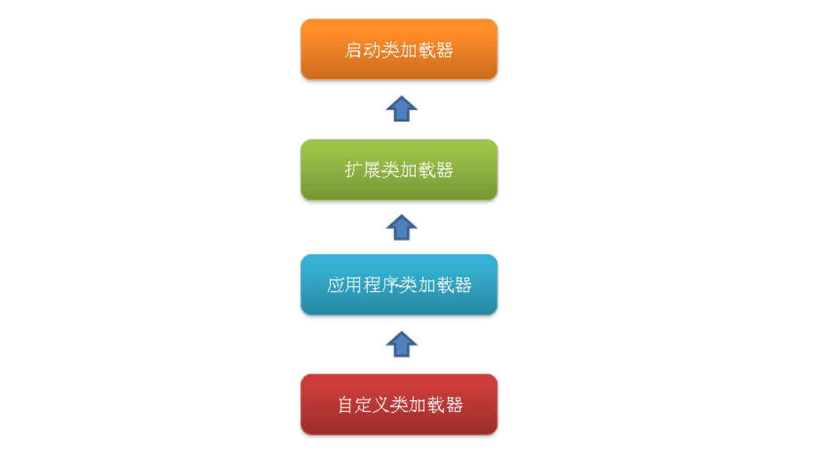

#### java内存区域：

 * 程序计数器

   每条线程都有一个独立的程序计数器，各线程间的计数器互不影响，因此该区域是线程私有的。

* java虚拟机栈

  该区域也是线程私有的，它的生命周期也与线程相同，栈帧用于存储局部变量表、操作数栈、动态链接、方法返回地址和一些额外的附加信息。

* 本地方法栈

  该区域与虚拟机栈所发挥的作用非常相似，只是虚拟机栈为虚拟机执行Java方法服务，而本地方法栈则为使用到的本地操作系统（Native）方法服务。

* java堆

  Java Heap是Java虚拟机所管理的内存中最大的一块，它是所有线程共享的一块内存区域。几乎所有的对象实例和数组都存放到java堆中。Java Heap是垃圾收集器管理的主要区域，因此很多时候也被称为“GC堆”。

* 方法区

  方法区也是各个线程共享的内存区域，它用于存储已经被虚拟机加载的类信息、常量、静态变量、即时编译器编译后的代码等数据。

* 直接内存

  java的NIO库允许java程序使用直接内存，从而提高性能，通常直接内存熟读会优于java堆。读写频繁的场合可能会考虑使用。

  直接内存并不是虚拟机运行时数据区的一部分，也不是Java虚拟机规范中定义的内存区域，它直接从操作系统中分配，因此不受Java堆大小的限制，但是会受到本机总内存的大小及处理器寻址空间的限制，因此它也可能导致OutOfMemoryError异常出现。

  ##### 对象实例化分析：

  ```java
  Object obj = new Object();
  ```

  这段代码的执行会涉及java栈、java堆、方法区三个最重要的内存区域。

  obj作为引用类型存放到java栈中，实例对象存放到java堆中，对象类型、父类、实现的接口、方法等一些类的信息存放到方法区。

#### 类初始化：

类初始化是类加载过程的最后一个阶段：

 * 遇到new、getstatic、putstatic、invokestatic这四条字节码指令时，如果类还没有进行过初始化，则需要先触发其初始化。生成这四条指令最常见的Java代码场景是：使用new关键字实例化对象时、读取或设置一个类的静态字段（static）时（被static修饰又被final修饰的，已在编译期把结果放入常量池的静态字段除外）、以及调用一个类的静态方法时。
* 使用Java.lang.refect包的方法对类进行反射调用时，如果类还没有进行过初始化，则需要先触发其初始化。
* 当初始化一个类的时候，如果发现其父类还没有进行初始化，则需要先触发其父类的初始化。
* 当虚拟机启动时，用户需要指定一个要执行的主类，虚拟机会先执行该主类。

通过子类引用父类中的静态字段，这时对子类的引用为被动引用，因此不会初始化子类，只会初始化父类：

```java
class Father{
	public static int m = 33;
	static{
		System.out.println("父类被初始化");
	}
}

class Child extends Father{
	static{
		System.out.println("子类被初始化");
	}
}

public class StaticTest{
	public static void main(String[] args){
		System.out.println(Child.m);
	}
}
```

输出结果：

```java
父类被初始化
33
```

#### 类加载机制：

java中的绑定：

​	静态绑定：即前期绑定。在程序执行前方法已经被绑定，此时由编译器或其它连接程序实现。针对java，简单的可以理解为程序编译期的绑定。java当中的方法只有final，static，private和构造方法是前期绑定的。

​	动态绑定：即晚期绑定，也叫运行时绑定。在运行时根据具体对象的类型进行绑定。在java中，几乎所有的方法都是后期绑定的。

加载阶段：

 * 通过一个类的全限定名来获取其定义的二进制字节流。
 * 将这个字节流所代表的静态存储结构转化为方法区的运行时数据结构。
 * 在Java堆中生成一个代表这个类的java.lang.Class对象，作为对方法区中这些数据的访问入口。

类加载器：（大致分为三类）

 * 启动类加载器：Bootstrap ClassLoader。它负责加载存放在JDK\jre\lib(JDK代表JDK的安装目录)下，或被-Xbootclasspath参数指定的路径中的，并且能被虚拟机识别的类库（如rt.jar，所有的java.*开头的类均被Bootstrap ClassLoader加载）。启动类加载器是无法被Java程序直接引用的。
 * 扩展类加载器：Extension ClassLoader，该加载器由sun.misc.Launcher$ExtClassLoader实现，它负责加载JDK\jre\lib\ext目录中，或者由java.ext.dirs系统变量指定的路径中的所有类库（如javax.*开头的类），开发者可以直接使用扩展类加载器。
 * 应用程序类加载器：Application ClassLoader，该类加载器由sun.misc.Launcher$AppClassLoader来实现，它负责加载用户类路径（ClassPath）所指定的类，开发者可以直接使用该类加载器，如果应用程序中没有自定义过自己的类加载器，一般情况下这个就是程序中默认的类加载器。

这几种类加载器的层次关系：



这种层次关系称为类加载器的双亲（父类）委派模型。这种父子关系并不是通过继承关系来实现的，而是使用组合关系来复用付加载器中的代码。

双亲委派模型的工作流程是：

​	如果一个类加载器收到了类加载的请求，它首先不会自己去尝试加载这个类，而是把请求委托给父加载器去完成，依次向上，因此，所有的类加载请求最终都应该被传递到顶层的启动类加载器中，只有当父加载器在它的搜索范围中没有找到所需的类时，即无法完成该加载，子加载器才会尝试自己去加载该类。

使用双亲委派模型来组织类加载器之间的关系的好处：

​	就是Java类随着它的类加载器（就是它所在的目录）一起具备了一种带有优先级的层次关系，这对于保证Java程序的稳定运作很重要。例如，java.lang.Object类存放在JDK\jre\lib下的rt.jar之中，因此无论是哪个类加载器要加载此类，最终都会委派给启动类加载器进行加载，这就保证了Object类在程序中的各种类加载器中都是同一个类。

##### 多态性实现机制——静态分派与动态分派：

 * 静态分派：

    所有依赖静态类型来定位方法执行版本的分派动作，都称为静态分派，静态分派的最典型应用就是多态性中的方法重载。

* 动态分派：

  在运行期根据实际类型确定方法执行版本的分派过程称为动态分派。多态性的方法覆写

  

#### java垃圾收集机制：

​	将java堆分为新生代和老年代。其中新生代存放新生的对象或者年龄不大的对象，老年代则存放老年对象。

​	新生代分为eden区、s0区、s1区，s0区和s1区也被称为from和to区域，他们是两块大小相等并且可以互换角色的空间。

​	绝大多数情况下，对象首先分配在eden区，在一次新生代回收后，如果对象还存活，则会进入s0或者s1区，之后每经历一次新生代回收，如果对象存活，则年龄加1，当对象达到一定的年龄后，则进入老年代。

##### 垃圾收集算法：

 * 标记——清除算法：

    标记—清除算法是最基础的收集算法，它分为“标记”和“清除”两个阶段：首先标记出所需回收的对象，在标记完成后统一回收掉所有被标记的对象，它的标记过程其实就是根据搜索算法中判定垃圾对象的标记过程。标记—清除算法的执行情况如下图所示：

   回收前状态：

   

    回收后状态：

   ​	 

   ​

   ​		 

   缺点：

   	* 标记和清除过程的效率都不高。


   	* 标记清除后会产生大量不连续的内存碎片，空间碎片太多可能会导致，当程序在以后的运行过程中需要分配较大对象时无法找到足够的连续内存而不得不触发另一次垃圾收集动作。

* 复制算法：

  复制算法是针对标记—清除算法的缺点，在其基础上进行改进而得到的，它将可用内存按容量分为大小相等的两块，每次只使用其中的一块，当其中一块的内存用完了，就将还存活着的对象复制到另外一块内存，然后再把已使用过的内存空间一次清理掉。

  优点：

   * 每次只对一块内存进行回收，运行高效。
   * 只需移动栈顶指针，按顺序分配内存即可，实现简单。
   * 内存回收时不用考虑内存碎片的出现。

   缺点：

  ​	可一次性分配的最大内存缩小了一半。

  执行情况：

  ​	回收前状态：

  

  ​

  ​       回收后状态：

  

  ​

  

* 标记——压缩：

  在标记清除算法的基础上做了优化，把存活的对象压缩到内存一端，而后进行垃圾清理。

  回收前状态：

  

  回收后状态：

  


  

  ##### 总结：

  ​	在新生代中，每次垃圾收集时都会发现有大量对象死去，只有少量存活，因此可选用复制算法来完成收集，而老年代中因为对象存活率高、没有额外空间对它进行分配担保，就必须使用标记——压缩算法来进行回收。

