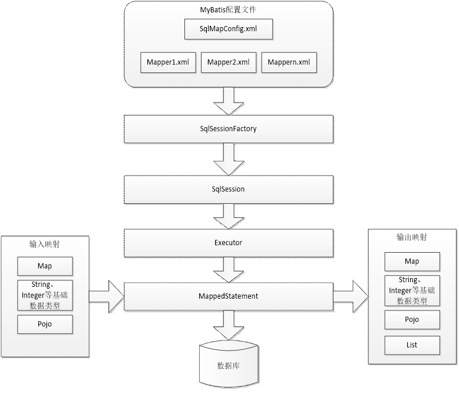

#### Mybatis架构：



##### Mybatis配置：

* SqlMapConfig.xml，此文件作为mybatis的全局配置文件，配置了mybatis的运行环境等信息。

* mapper.xml文件即sql映射文件，文件中配置了操作数据库的sql语句。此文件需要在SqlMapConfig.xml中加载。

* 通过mybatis环境等配置信息构造SqlSessionFactory即会话工厂

* 由会话工厂创建sqlSession即会话，操作数据库需要通过sqlSession进行。

* mybatis底层自定义了Executor执行器接口操作数据库，Executor接口有两个实现，一个是基本执行器、一个是缓存执行器。

* Mapped Statement也是mybatis一个底层封装对象，它包装了mybatis配置信息及sql映射信息等。mapper.xml文件中一个sql对应一个Mapped Statement对象，sql的id即是Mapped statement的id。

* Mapped Statement对sql执行输入参数进行定义，包括HashMap、基本类型、pojo，Executor通过Mapped Statement在执行sql前将输入的java对象映射至sql中，输入参数映射就是jdbc编程中对preparedStatement设置参数。

* Mapped Statement对sql执行输出结果进行定义，包括HashMap、基本类型、pojo，Executor通过Mapped Statement在执行sql后将输出结果映射至java对象中，输出结果映射过程相当于jdbc编程中对结果的解析处理过程。

  ##### Mybatis和Hibernate的区别：

   * Mybatis和hibernate不同，它不完全是一个ORM框架，因为MyBatis需要程序员自己编写Sql语句。mybatis可以通过XML或注解方式灵活配置要运行的sql语句；
   * mybatis无法做到数据库无关性；
   * Hibernate对象/关系映射能力强，数据库无关性好，对于关系模型要求高的软件（例如需求固定的定制化软件）如果用hibernate开发可以节省很多代码，提高效率。

  ##### Mapper动态代理方式：

  ​	遵循一下规范：

   * Mapper.xml文件中的namespace与mapper接口的类路径相同。

   * Mapper接口方法名和Mapper.xml中定义的每个statement的id相同

   * Mapper接口方法的输入参数类型和mapper.xml中定义的每个sql 的parameterType的类型相同

   * Mapper接口方法的输出参数类型和mapper.xml中定义的每个sql的resultType的类型相同

     注册指定包下的所有mapper接口：

     例如：

     ```xml
     <package name="com.mybatis.mapper"/>
     ```

     注意：此种方法要求mapper接口名称和mapper映射文件名称相同，且放在同一个目录中。

  #### 动态SQL：

   * where
  * if
  * foreach

  ```xml
  <select id="queryUsersByWhere" parameterType="User" resultType="User">
  		select * from user
  		<!-- where标签可以自动添加where，同时处理sql语句中第一个and关键字 -->
  		<where>
  			<if test="sex !=null and sex !=''">
  				sex = #{sex}
  			</if>
  			<if test="username !=null and username !=''">
  				and username like '%${username}%'
  			</if>
  		</where>

  	</select>
  ```

  ```xml
  <select id="queryUsersByIds" parameterType="com.mybatis.vo.QueryVo" resultType="User">
  		select * from user
  		<where>
  			<!-- foreach标签，进行遍历 -->
  			<!-- collection：遍历的集合，这里是QueryVo的ids属性 -->
  			<!-- item：遍历的项目，可以随便写，，但是和后面的#{}里面要一致 -->
  			<!-- open：在前面添加的sql片段 -->
  			<!-- close：在结尾处添加的sql片段 -->
  			<!-- separator：指定遍历的元素之间使用的分隔符 -->

  			<foreach collection="ids" item="id" separator="," open="id in (" close=")">
  				#{id}
  			</foreach>
  		</where>
  	</select>
  ```

  ```xml
  <!--配置一对多-->
  <resultMap type="user" id="userOrderResultMap">
  		<id property="id" column="user_id"/>
  		<result property="username" column="username"/>
  		<result property="sex" column="sex"/>
  		<result property="birthday" column="birthday"/>
  		<result property="address" column="address"/>
  		<!-- 配置一对多关系 -->
  		<!-- ofType:映射到list集合属性中pojo的类型 -->
  		<collection property="orders" ofType="Orders">
  			<id property="id" column="id"/>
  			<result property="number" column="number"/>
  			<result property="createtime" column="createtime"/>
  			<result property="note" column="note"/>
  		</collection>
  	</resultMap>
  	<select id="queryUserOrder" resultMap="userOrderResultMap">
  		select 
  		o.id,
  		o.user_id,
  		o.number,
  		o.createtime,
  		o.note,
  		u.username,
  		u.sex,
  		u.birthday,
  		u.address 
  		from user u
  		left join orders o on o.user_id = u.id
  	</select>
  ```

  ```xml
  <!--配置一对一-->
  <resultMap type="Orders" id="orderResultMap">
  	
  		<!-- 定义主键 ,非常重要。如果是多个字段,则定义多个id -->
  		<id property="id" column="id"/>
  		<!-- property：主键在pojo中的属性名 -->
  		<!-- column：主键在数据库中的列名 -->
  		<result property="userId" column="user_id"/>
  		<result property="number" column="number"/>
  		<result property="createtime" column="createtime"/>
  		<result property="note" column="note"/>
  	</resultMap>
  	
  	<select id="queryOrderAll" resultMap="orderResultMap">
  		select * from orders
  	</select>
  ```

  #### Mybatis和Spring整合：

  	* applicationContext.xml

  ```xml
  <?xml version="1.0" encoding="UTF-8"?>
  <beans xmlns="http://www.springframework.org/schema/beans"
  	xmlns:context="http://www.springframework.org/schema/context" xmlns:p="http://www.springframework.org/schema/p"
  	xmlns:aop="http://www.springframework.org/schema/aop" xmlns:tx="http://www.springframework.org/schema/tx"
  	xmlns:xsi="http://www.w3.org/2001/XMLSchema-instance"
  	xsi:schemaLocation="http://www.springframework.org/schema/beans http://www.springframework.org/schema/beans/spring-beans-4.0.xsd
  	http://www.springframework.org/schema/context http://www.springframework.org/schema/context/spring-context-4.0.xsd
  	http://www.springframework.org/schema/aop http://www.springframework.org/schema/aop/spring-aop-4.0.xsd http://www.springframework.org/schema/tx http://www.springframework.org/schema/tx/spring-tx-4.0.xsd
  	http://www.springframework.org/schema/util http://www.springframework.org/schema/util/spring-util-4.0.xsd">
  	
  	<context:property-placeholder location="classpath:db.properties"/>
  	<!-- 数据库连接池 -->
  	<bean id="dataSource" class="org.apache.commons.dbcp.BasicDataSource"
  		destroy-method="close">
  		<property name="driverClassName" value="${jdbc.driver}" />
  		<property name="url" value="${jdbc.url}" />
  		<property name="username" value="${jdbc.username}" />
  		<property name="password" value="${jdbc.password}" />
  		<property name="maxActive" value="10" />
  		<property name="maxIdle" value="5" />
  	</bean>
  	<!-- 配置sqlSessionFactory -->
  	<bean id="sqlSessionFactoryBean" class="org.mybatis.spring.SqlSessionFactoryBean">
  		<property name="configLocation" value="classpath:sqlMapConfig.xml"></property>
  		<property name="dataSource" ref="dataSource"></property>
  	</bean>
  	<!-- 配置代理对象 -->
  <!-- 	<bean id="userMapper" class="org.mybatis.spring.mapper.MapperFactoryBean"> -->
  		
  <!-- 		<property name="mapperInterface" value="com.mybatis.mapper.UserMapper"></property> -->
  		
  <!-- 		<property name="sqlSessionFactory" ref="sqlSessionFactoryBean"></property> -->
  		
  <!-- 	</bean> -->
  	<!-- 动态代理开发 扫描 -->
  	<bean class="org.mybatis.spring.mapper.MapperScannerConfigurer">
  		<!-- 基本包 -->
  		<property name="basePackage" value="com.mybatis.mapper"></property>
  	</bean>
  	
  </beans>
  ```

* db.properties

  ```properties
  jdbc.driver=com.mysql.jdbc.Driver
  jdbc.url=jdbc:mysql://localhost:3306/mybatis?characterEncoding=utf-8
  jdbc.username=root
  jdbc.password=root
  ```

* log4j.properties

  ```properties
  # Global logging configuration
  log4j.rootLogger=DEBUG, stdout
  # Console output...
  log4j.appender.stdout=org.apache.log4j.ConsoleAppender
  log4j.appender.stdout.layout=org.apache.log4j.PatternLayout
  log4j.appender.stdout.layout.ConversionPattern=%5p [%t] - %m%n

  ```

* sqlMapConfig.xml

  ```xml
  <?xml version="1.0" encoding="UTF-8" ?>
  <!DOCTYPE configuration
  PUBLIC "-//mybatis.org//DTD Config 3.0//EN"
  "http://mybatis.org/dtd/mybatis-3-config.dtd">
  <configuration>

  	<typeAliases>
  		<package name="com.mybatis.pojo"/>
  	</typeAliases>
  	
  	<mappers>
  		<package name="com.mybatis.mapper"/>
  	</mappers>
  </configuration>

  ```

* 测试：

  ```java
  @Test
  	public void testMapper() throws Exception {
  		
  		ApplicationContext ac = new ClassPathXmlApplicationContext("applicationContext.xml");
  		//UserMapper userMapper = (UserMapper) ac.getBean("userMapper");
  		UserMapper userMapper = ac.getBean(UserMapper.class);
  		User user = userMapper.findUserById(10);
  		System.out.println(user);
  	}
  ```

  ​