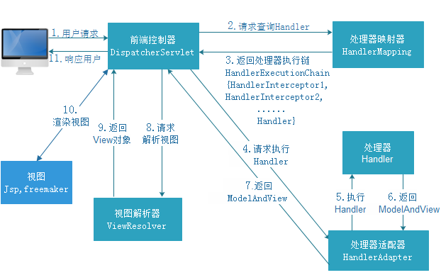

#### springmvc配置：

需要在web.xml中配置前端控制器DispatcherServlet

```xml
<!-- 前端控制器 -->
  <servlet>
  	<servlet-name>springmvc</servlet-name>
  	<servlet-class>org.springframework.web.servlet.DispatcherServlet</servlet-class>
  	<init-param>
  		<param-name>contextConfigLocation</param-name>
  		<param-value>classpath:springmvc.xml</param-value>
  	</init-param>
  </servlet>
  <servlet-mapping>
  	<servlet-name>springmvc</servlet-name>
      <!-- 
		/表示过滤所有包括jsp、css等
		/*表示除了jsp，剩下的过滤
		*.action表示过滤后缀名
-->
  	<url-pattern>*.action</url-pattern>
  </servlet-mapping>
```

#### 框架结构：



* 用户发送请求至前端控制器DispatcherServlet

* DispatcherServlet收到请求调用HandlerMapping处理器映射器。

* 处理器映射器根据请求url找到具体的处理器，生成处理器对象及处理器拦截器(如果有则生成)一并返回给DispatcherServlet。

* DispatcherServlet通过HandlerAdapter处理器适配器调用处理器

* 执行处理器(Controller，也叫后端控制器)。

* Controller执行完成返回ModelAndView

* HandlerAdapter将controller执行结果ModelAndView返回给DispatcherServlet

* DispatcherServlet将ModelAndView传给ViewReslover视图解析器

* ViewReslover解析后返回具体View

* DispatcherServlet对View进行渲染视图（即将模型数据填充至视图中）。

* DispatcherServlet响应用户

  #### 说明：

  在springmvc的各个组件中，处理器映射器（HandlerMapping）、处理器适配器（HandlAdapter）、视图解析器（ViewResolver）称为springmvc的三大组件。需要我们开发的组件有handler、view

  #### 组件扫描器：

  ```xml
  <!-- 配置扫描包 -->
  	<context:component-scan base-package="com.springmvc"></context:component-scan>
  ```

  #### 配置处理器映射器：

  从spring3.1版本开始，废除了DefaultAnnotationHandlerMapping的使用，推荐使用RequestMappingHandlerMapping完成注解式处理器映射。

  ```xml
  <!-- 处理器映射器 -->
  	<bean class="org.springframework.web.servlet.mvc.method.annotation.RequestMappingHandlerMapping"></bean>
  ```

  #### 配置处理器适配器：

  从spring3.1版本开始，废除了AnnotationMethodHandlerAdapter的使用，推荐使用RequestMappingHandlerAdapter完成注解式处理器适配。

  ```xml
  <!-- 处理器适配器 -->
  	<bean class="org.springframework.web.servlet.mvc.method.annotation.RequestMappingHandlerAdapter"></bean>
  ```

  #### 配置注解驱动：

  直接配置处理器映射器和处理器适配器比较麻烦，SpringMVC在springmvc.xml中使用注解驱动来加载RequestMappingHandlerMapping和RequestMappingHandlerAdapter

  ```xml
  <mvc:annotation-driven />
  ```

  #### 配置视图解析器：

  ```xml
  <!-- 配置视图解析器 -->
  <!-- 
  	例如：/WEB-INF/jsp/test.jsp
  	之后只需要在程序中书写test即可
  -->
  	<bean class="org.springframework.web.servlet.view.InternalResourceViewResolver">
  		<property name="prefix" value="/WEB-INF/jsp/"></property>
  		<property name="suffix" value=".jsp"></property>
  	</bean>
  ```

  #### 配置监听器加载配置文件：

  ```xml
  <context-param>
    	<param-name>contextConfigLocation</param-name>
    	<param-value>classpath:applicationContext.xml</param-value>
    </context-param>
    
    <!-- 配置监听器 -->
    <listener>
    	<listener-class>org.springframework.web.context.ContextLoaderListener</listener-class>
    </listener>
  ```

  #### 解决post提交乱码问题：

  ```xml
  <!-- 过滤器 -->
    <filter>
    	<filter-name>encoding</filter-name>
    	<filter-class>org.springframework.web.filter.CharacterEncodingFilter</filter-class>
    	<init-param>
    		<param-name>encoding</param-name>
    		<param-value>UTF-8</param-value>
    	</init-param>
    </filter>
    <filter-mapping>
    	<filter-name>encoding</filter-name>
    	<url-pattern>*.action</url-pattern>
    </filter-mapping>
  ```

  #### 配置Converter：

  ```xml
  <!-- 配置注解驱动 -->
  	<mvc:annotation-driven conversion-service="formattingConversionServiceFactoryBean"/>

  	<!--转换 -->
  	<bean id="formattingConversionServiceFactoryBean" class="org.springframework.format.support.FormattingConversionServiceFactoryBean">
  		<property name="converters">
  			<list>
  				<bean class="com.springmvc.convertion.DateConveter"></bean>
  			</list>
  		</property>
  	</bean>
  ```

  #### springmvc于Struts2的区别：

  * springmvc的入口是一个servlet即前端控制器，而struts2入口是一个filter过滤器。
  * springmvc是基于方法开发(一个url对应一个方法)，请求参数传递到方法的形参，可以设计为单例或多例(建议单例)，struts2是基于类开发，传递参数是通过类的属性，只能设计为多例。
  * Struts采用值栈存储请求和响应的数据，通过OGNL存取数据， springmvc通过参数解析器是将request请求内容解析，并给方法形参赋值，将数据和视图封装成ModelAndView对象，最后又将ModelAndView中的模型数据通过request域传输到页面。Jsp视图解析器默认使用jstl。

  ​